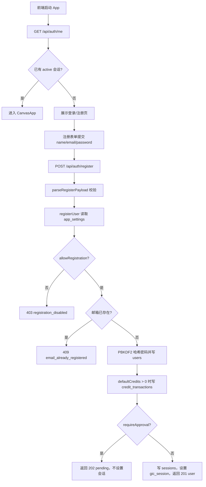

## 问题与范围

本次探索回答：当前用户从前端注册入口提交，到后端创建账号、处理审核和会话的链路是什么。

范围覆盖：

- 前端认证页：`apps/web/src/App.tsx`
- 后端注册路由与请求校验：`apps/api/src/server/routes/auth.ts`、`apps/api/src/server/http/validation.ts`
- 账号、会话、设置和注册赠送积分：`apps/api/src/domain/auth/auth-store.ts`
- 管理端注册开关：`apps/api/src/server/routes/admin.ts`、`apps/api/src/domain/admin/admin-store.ts`
- 持久化表结构：`apps/api/src/infrastructure/schema.ts`、`sqlite-database.ts`、`mysql-database.ts`

## 速答

当前注册链路是：前端先通过 `/api/auth/me` 读取登录状态和注册设置；未登录时展示登录/注册页；用户切到注册后提交 `name/email/password` 到 `/api/auth/register`；API 校验 JSON、名称、邮箱和密码；`registerUser` 读取 `app_settings`，检查是否开放注册、邮箱是否重复，随后哈希密码并插入 `users`，同时按 `defaultCredits` 写注册赠送积分流水。若 `requireApproval=false`，立即创建 30 天会话、写 `sessions`、设置 `gic_session` Cookie，并返回 201 + user；若 `requireApproval=true`，账号状态为 `pending`，不建会话，返回 202 + pending，前端提示等待管理员审核并切回登录。

## 关键证据

1. 前端启动时调用 `/api/auth/me`，用响应里的 `settings.allowRegistration` 控制注册入口是否可用；未登录时渲染认证页，已登录时直接进入 `CanvasApp`。证据：`apps/web/src/App.tsx:42`、`apps/web/src/App.tsx:79`、`apps/web/src/App.tsx:154`、`apps/web/src/App.tsx:175`。
2. 注册表单只在 `mode === "register"` 时带 `name`，提交目标为 `/api/auth/register`，成功后区分 `pending` 与带 `user` 的会话响应。证据：`apps/web/src/App.tsx:91`、`apps/web/src/App.tsx:98`、`apps/web/src/App.tsx:111`、`apps/web/src/App.tsx:123`。
3. API 注册路由先读 JSON，再调用 `parseRegisterPayload`，随后调用 `registerUser`；有 token 时设置会话 Cookie 并返回 201，否则返回 202。证据：`apps/api/src/server/routes/auth.ts:14`、`apps/api/src/server/routes/auth.ts:20`、`apps/api/src/server/routes/auth.ts:26`、`apps/api/src/server/routes/auth.ts:27`、`apps/api/src/server/routes/auth.ts:32`。
4. 注册请求校验要求对象、有效名称、规范化邮箱和至少 8 位密码；邮箱会 trim + lowercase，并用简单邮箱正则检查。证据：`apps/api/src/server/http/validation.ts:99`、`apps/api/src/server/http/validation.ts:107`、`apps/api/src/server/http/validation.ts:115`、`apps/api/src/server/http/validation.ts:123`、`apps/api/src/server/http/validation.ts:1060`、`apps/api/src/server/http/validation.ts:1069`、`apps/api/src/server/http/validation.ts:1082`。
5. `registerUser` 读取注册设置，关闭注册时报 `registration_disabled`，邮箱重复时报 `email_already_registered`；新用户默认为 `role=user`，状态由 `requireApproval` 决定，积分来自 `defaultCredits`。证据：`apps/api/src/domain/auth/auth-store.ts:119`、`apps/api/src/domain/auth/auth-store.ts:120`、`apps/api/src/domain/auth/auth-store.ts:121`、`apps/api/src/domain/auth/auth-store.ts:125`、`apps/api/src/domain/auth/auth-store.ts:126`、`apps/api/src/domain/auth/auth-store.ts:132`、`apps/api/src/domain/auth/auth-store.ts:139`、`apps/api/src/domain/auth/auth-store.ts:140`、`apps/api/src/domain/auth/auth-store.ts:141`。
6. 密码使用 16 字节随机盐和 PBKDF2-SHA256 210000 次派生，注册只保存 salt、iterations、hash；会话 token 是随机 32 字节，数据库只存 SHA-256 哈希。证据：`apps/api/src/domain/auth/password.ts:5`、`apps/api/src/domain/auth/password.ts:15`、`apps/api/src/domain/auth/password.ts:36`、`apps/api/src/domain/auth/password.ts:40`、`apps/api/src/domain/auth/auth-store.ts:280`、`apps/api/src/domain/auth/auth-store.ts:293`。
7. 用户写入和注册赠送积分在 SQLite 事务或 MySQL 事务内一起完成，赠送流水 reason 是 `registration_bonus`。证据：`apps/api/src/domain/auth/auth-store.ts:404`、`apps/api/src/domain/auth/auth-store.ts:423`、`apps/api/src/domain/auth/auth-store.ts:432`、`apps/api/src/domain/auth/auth-store.ts:454`、`apps/api/src/domain/auth/auth-store.ts:483`。
8. 管理端可改 `allowRegistration`、`requireApproval`、`defaultCredits`；默认设置为允许注册、不需要审核、注册送 10 积分。证据：`apps/api/src/domain/auth/auth-store.ts:307`、`apps/api/src/domain/auth/auth-store.ts:318`、`apps/api/src/domain/auth/auth-store.ts:319`、`apps/api/src/domain/auth/auth-store.ts:320`、`apps/api/src/server/routes/admin.ts:81`、`apps/api/src/server/routes/admin.ts:90`、`apps/api/src/domain/admin/admin-store.ts:268`、`apps/web/src/features/admin/AdminPage.tsx:769`、`apps/web/src/features/admin/AdminPage.tsx:780`、`apps/web/src/features/admin/AdminPage.tsx:791`。

## 细节展开

### 前端入口

`App` 启动后通过 `/api/auth/me` 获取当前用户和认证设置。`allowRegistration` 控制注册 tab 是否 disabled；`adminConfigured` 只影响提示文案，不阻止注册按钮本身。注册模式下表单展示名称、邮箱、密码三项；密码输入前端 `minLength=8`，后端仍会再次校验。

提交时，登录模式发送 `{ email, password }` 到 `/api/auth/login`；注册模式发送完整表单 `{ name, email, password }` 到 `/api/auth/register`。注册成功有两种分支：如果响应是 `{ status: "pending" }`，前端提示“账号已提交审核”，清空表单并切回登录；如果响应有 `user`，前端设置当前用户并重新拉取 `/api/auth/me`。

### 后端注册路由

`POST /api/auth/register` 是注册唯一 HTTP 入口。路由负责三层包装：读取 JSON、校验请求形状、把领域错误转成统一 `{ error }` 响应。真正业务在 `registerUser`。

`parseRegisterPayload` 做最小账号字段校验：

- `name`：字符串，trim，连续空白压成单空格，非空且不超过名称长度上限。
- `email`：字符串，trim + lowercase，不超过 254，用正则判断基本邮箱形态。
- `password`：字符串，长度至少 8。

### 领域逻辑

`registerUser` 先调用 `getAuthSettings`，底层读取 `app_settings`；设置行不存在时会由 `ensureAppSettings` 初始化，默认开放注册、不需要审核、注册送 10 积分。

注册业务顺序：

1. `allowRegistration=false`：直接抛 `registration_disabled`，HTTP 403。
2. 规范化邮箱并查重：重复抛 `email_already_registered`，HTTP 409。
3. 生成 `user-${randomUUID()}`。
4. 用 PBKDF2 生成密码哈希材料。
5. 写 `users`，字段包含 `role=user`、`status=active|pending`、`credits=defaultCredits`。
6. 若 `credits > 0`，同时写 `credit_transactions`，reason 为 `registration_bonus`。
7. 若账号不是 active，返回 pending，不创建 session。
8. 若账号 active，创建会话，返回用户和 token。

### 会话与 Cookie

会话 TTL 为 30 天。后端生成随机 session token，只把 token 的 SHA-256 哈希写入 `sessions`。HTTP 响应通过 `setSessionCookie` 设置 `gic_session`，属性为 `HttpOnly`、`Path=/`、`SameSite=Lax`，生产或 `COOKIE_SECURE=true` 时带 `Secure`。

后续 `/api/auth/me` 通过 Cookie 查 session，过期就删 session；找不到 active 用户也会删 session。登录态用户响应里还带签到状态。

### 管理端控制点

注册链路受 `app_settings` 三个字段直接影响：

- `allow_registration`：关闭后 `/api/auth/register` 返回 403，前端注册 tab 也禁用。
- `require_approval`：打开后新用户是 `pending`，不发会话，需要管理员激活后才能登录。
- `default_credits`：新用户初始积分，也是注册赠送流水金额。

管理员页面通过 `/api/admin/settings` 读取和 PATCH 这些设置；接口要求 active admin 会话。

### 持久化结构

SQLite 和 MySQL 都有同一组核心表：

- `users`：账号、密码哈希材料、角色、状态、积分。
- `sessions`：会话 token 哈希、用户、过期时间、最近访问时间。
- `app_settings`：注册、审核、积分和生成限制设置。
- `credit_transactions`：注册赠送积分流水等积分变更记录。

SQLite 上 `users(email)` 有唯一索引；MySQL 建表定义也包含 email 唯一约束。应用层查重存在，但数据库唯一约束才是并发注册同邮箱的最终保护。

## 未决问题

- 本次只读代码，没有连接当前运行数据库；当前环境实际的 `allow_registration`、`require_approval`、`default_credits` 运行值未确认。
- 没有跑端到端注册请求；本文描述的是代码静态链路。

## 后续建议

如果要验证当前实例的真实注册策略，下一步应在本地服务或数据库中读取 `app_settings`，并用一次临时账号跑 `/api/auth/register` 的 201 / 202 分支。

## 相关文档

- `docs/SECURITY.md`：说明本地账号登录边界、会话 Cookie 要求、管理员 bootstrap 密码规则。
- `docs/RELIABILITY.md`：说明注册赠送积分必须和 `credit_transactions` 在事务内一致写入。
