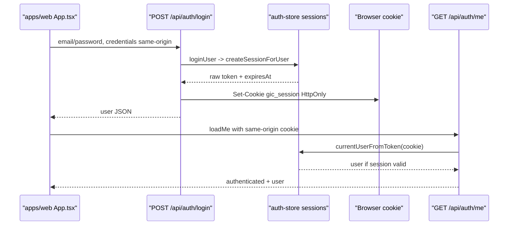

## 问题与范围

问题：前端用户登录时，会不会进行持久化处理？

范围：检查 `apps/web/src/App.tsx` 的登录和启动状态恢复逻辑，追到 `apps/api/src/server/routes/auth.ts`、`apps/api/src/server/http/auth.ts` 和 `apps/api/src/domain/auth/auth-store.ts` 的会话创建、cookie 和数据库持久化逻辑。

## 速答

会持久化登录态，但不是由前端写 `localStorage` 或 `sessionStorage`。前端登录成功后只把当前用户放进 React state，并立即调用 `/api/auth/me` 复查状态；真正的持久化由后端完成：登录接口创建 session，把 session token hash 写入 `sessions` 表，再通过 `HttpOnly` 的 `gic_session` cookie 发给浏览器。页面刷新后，前端启动时请求 `/api/auth/me`，浏览器自动带上同源 cookie，后端用 cookie 查 session 并恢复用户。

## 关键证据

- `apps/web/src/App.tsx:31` 到 `apps/web/src/App.tsx:40`：前端登录态只有 `currentUser`、`authStatus` 等 React state，未定义 auth storage key。
- `apps/web/src/App.tsx:93` 到 `apps/web/src/App.tsx:127`：登录提交调用 `/api/auth/login`，设置 `credentials: "same-origin"`；成功后 `setCurrentUser(body.user)`，再 `loadMe(... preserveCurrentUserOnError: true)`，没有写本地持久化存储。
- `apps/web/src/App.tsx:42` 到 `apps/web/src/App.tsx:57`：页面启动/复查通过 `/api/auth/me` 获取 `authenticated` 和 `user`，同样使用 `credentials: "same-origin"`。
- `apps/api/src/server/routes/auth.ts:38` 到 `apps/api/src/server/routes/auth.ts:52`：登录路由调用 `loginUser`，随后 `setSessionCookie(c, session.token, session.expiresAt)`。
- `apps/api/src/server/http/auth.ts:8` 和 `apps/api/src/server/http/auth.ts:55` 到 `apps/api/src/server/http/auth.ts:62`：session cookie 名为 `gic_session`，设置 `expires`、`httpOnly`、`path: "/"`、`sameSite: "Lax"` 和按环境控制的 `secure`。
- `apps/api/src/domain/auth/auth-store.ts:288` 到 `apps/api/src/domain/auth/auth-store.ts:316`：`createSessionForUser` 创建 token hash、计算 30 天后的 `expiresAt`，并写入 SQLite 或 MySQL 的 `sessions` 表。
- `apps/api/src/domain/auth/auth-store.ts:190` 到 `apps/api/src/domain/auth/auth-store.ts:216`：后续请求通过 cookie token hash 查 session，过期或用户不可用会删 session，否则返回 `CurrentUser`。
- `apps/web/src/shared/i18n/index.tsx:2073` 和 `apps/web/src/features/pool/promptPoolFilters.ts:75`：仓库里的 `localStorage` 用在语言和 prompt pool 过滤器，不是用户登录 token 或用户信息。

## 细节展开

前端登录页面的持久化边界很薄：`submitAuth` 只提交凭据、接收用户 JSON、更新内存态，并靠 `loadMe` 拉取后端认证状态。刷新页面后，`useEffect` 会调用 `loadMe`，不依赖任何前端本地缓存。

服务端承担会话持久化。`loginUser` 验证密码和账号状态后调用 `createSessionForUser`。该函数生成 32 字节随机 token，将 SHA-256 hash 写入数据库，只把原始 token 发进 cookie。`/api/auth/me` 读取 `gic_session` cookie，再用 hash 查 `sessions` 表恢复用户。

退出登录也按同一模型清理：前端调用 `/api/auth/logout` 后只清空内存态；后端删除 session hash 并清 cookie。

## 未决问题

无。当前代码证据足够确认登录态持久化位置和恢复路径。

## 后续建议

如果要改变“记住登录”策略，重点应改服务端 session TTL/cookie 策略，而不是在前端新增 token 存储。

## 相关文档

- `.codestable/attention.md`
- `.codestable/reference/system-overview.md`
- `.codestable/reference/shared-conventions.md`
