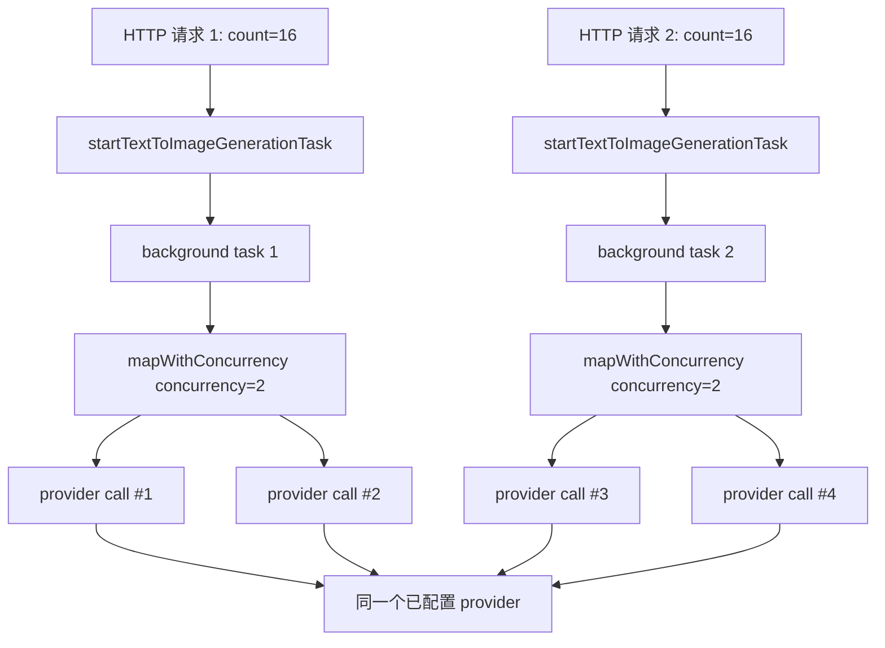

**[已过期]** 当前代码已实现 Redis provider scheduler、generation queue worker 和 Agent queue adapter。本旧结论已由 `2026-05-29-explore-generation-redis-task-rate-limit.md` 取代。

## 问题与范围

本次探索回答：如果当前只有一个图片 provider，同时来了两个生成任务，每个任务生成 16 张图，当前代码会如何并发执行。

范围覆盖：

- 手动图片生成入口：`apps/api/src/server/routes/images.ts`
- 后台生成任务管理：`apps/api/src/domain/generation/generation-tasks.ts`
- 单任务批量输出并发：`apps/api/src/domain/generation/image-generation.ts`
- Agent 执行并发：`apps/api/src/domain/agent/executor.ts`
- 生成数量校验与单次上限：`apps/api/src/server/http/validation.ts`、`apps/api/src/domain/credits/credit-store.ts`

## 速答

当前没有全局 provider 并发闸门。手动生成时，每个 `count=16` 任务内部最多同时跑 2 个 provider 调用；两个任务同时存在时，会叠加成最多 4 个同时打到同一个 provider 的调用。两个任务总共会发起 32 次 provider 调用，通常表现为每个任务各自按 2 并发推进，谁先完成一个输出谁就继续取下一个。

Agent 路径也没有跨请求全局闸门。单个 Agent plan 内 runnable jobs 最多 2 个并发；每个 job 内部仍会走单任务 `BATCH_CONCURRENCY=2`。不过同一个 Agent plan 的总图片数被限制为 16，因此一个 plan 里不能合法存在两个各 16 张的 job。

## 关键证据

1. 手动生成入口直接调用 `startTextToImageGenerationTask`，没有 route 级队列或 provider lock。证据：`apps/api/src/server/routes/images.ts:23` 到 `apps/api/src/server/routes/images.ts:40`。
2. `startTextToImageGenerationTask` 先检查生成 ID、预扣积分、创建 running record，然后调用 `startBackgroundGenerationTask`。HTTP 只返回 record，不等待所有 16 张生成结束。证据：`apps/api/src/domain/generation/generation-tasks.ts:31` 到 `apps/api/src/domain/generation/generation-tasks.ts:63`。
3. `activeGenerationTasks` 是 `Map<generationId, AbortController>`，用于取消和清理，不是并发限制器。证据：`apps/api/src/domain/generation/generation-tasks.ts:20` 到 `apps/api/src/domain/generation/generation-tasks.ts:24`，以及 `apps/api/src/domain/generation/generation-tasks.ts:197` 到 `apps/api/src/domain/generation/generation-tasks.ts:216`。
4. 每个后台任务都会创建已配置 provider，然后进入 `finishTextToImageGeneration` 或 `finishReferenceImageGeneration`；没有共享 semaphore。证据：`apps/api/src/domain/generation/generation-tasks.ts:58` 到 `apps/api/src/domain/generation/generation-tasks.ts:60`，以及 `apps/api/src/domain/generation/generation-tasks.ts:93` 到 `apps/api/src/domain/generation/generation-tasks.ts:95`。
5. 单个任务的输出并发常量是 `BATCH_CONCURRENCY = 2`，`finishTextToImageGeneration` 对 `input.count` 个输出调用 `mapWithConcurrency(..., BATCH_CONCURRENCY, generateSingleOutput)`。证据：`apps/api/src/domain/generation/image-generation.ts:53`，以及 `apps/api/src/domain/generation/image-generation.ts:195` 到 `apps/api/src/domain/generation/image-generation.ts:208`。
6. `mapWithConcurrency` 的 worker 数是 `Math.min(concurrency, items.length)`，每个 worker 完成一个输出后继续取下一个输出。证据：`apps/api/src/domain/generation/image-generation.ts:891` 到 `apps/api/src/domain/generation/image-generation.ts:908`。
7. 请求层只允许 `count` 是 `1、2、4、8、16`；另外积分设置会用 `maxImagesPerRequest` 兜底拒绝超过系统设置的单次数量。证据：`apps/api/src/server/http/validation.ts:954` 到 `apps/api/src/server/http/validation.ts:972`，以及 `apps/api/src/domain/credits/credit-store.ts:295` 到 `apps/api/src/domain/credits/credit-store.ts:304`。
8. Agent 内部有 `AGENT_JOB_CONCURRENCY = 2`，执行 runnable jobs 时也用 `mapWithConcurrency`；每个 job 再进入普通生成 task。证据：`apps/api/src/domain/agent/executor.ts:26` 到 `apps/api/src/domain/agent/executor.ts:27`，`apps/api/src/domain/agent/executor.ts:117` 到 `apps/api/src/domain/agent/executor.ts:145`，以及 `apps/api/src/domain/agent/executor.ts:216` 到 `apps/api/src/domain/agent/executor.ts:230`。

## 细节展开

### 手动生成两任务各 16 张

执行顺序是：

1. 请求 1 进入 `/api/images/generate`，通过认证和 payload 校验。
2. API 为请求 1 预扣 16 张对应积分，创建 running generation record，启动 background task。
3. 请求 2 走同一流程，独立预扣积分、创建第二条 running record、启动第二个 background task。
4. 每个 background task 内部对 16 个输出索引开 2 个 worker。
5. 因为两个 background task 互不感知，所以同一时刻最多有 `2 + 2 = 4` 个 provider 调用并发。
6. 每个任务完成一个输出后会继续取该任务的下一个输出，直到 16 个输出都处理完。

### 单 provider 的含义

代码层面的“只有一个 provider”只影响 `createConfiguredImageProvider` 选出的 provider 来源；它不会自动把所有调用串行化。同一个 provider source 被两个 background task 同时使用时，当前没有跨任务共享队列、token bucket、semaphore 或 Redis lock。

### Agent 路径

Agent 额外有一层 job 并发：每轮最多 2 个 runnable jobs 同时跑。每个 job 如果是生成 8 张或 16 张，进入 `runTextToImageGenerationTask` 后仍会使用单任务 2 并发。单个 plan 的总图数上限是 16，所以“同一个 Agent plan 中两个 job 各 16 张”不是合法计划；但两个独立 Agent run 或一个 plan 内两个 8 张 job 仍会让 provider 调用叠加。

## 未决问题

- 本次只读代码，没有压测实际 provider，也没有确认当前运行环境的 `maxImagesPerRequest` 设置值。
- 本次没有检查具体 provider 的外部 rate limit；当前结论只描述本应用内部并发行为。

## 后续建议

如果只接一个 provider 且关心稳定性，下一步应设计一个全局 provider 并发闸门，让手动生成和 Agent 共用同一把 semaphore；单进程先用内存 semaphore，未来多实例再升级为 Redis semaphore。
