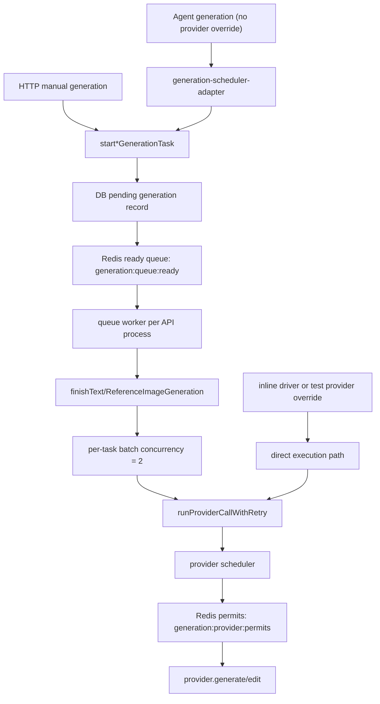

## 问题与范围

本次探索回答：现在是否已经有“对任务的全局 Redis 限流”。

范围覆盖：

- Redis runtime 与 driver 选择：`apps/api/src/infrastructure/redis-runtime.ts`
- 生成任务入队与 worker：`apps/api/src/domain/generation/generation-queue.ts`、`apps/api/src/domain/generation/generation-tasks.ts`
- provider 全局并发闸门：`apps/api/src/domain/generation/provider-scheduler.ts`
- 单图 provider 调用入口：`apps/api/src/domain/generation/image-generation.ts`、`apps/api/src/domain/generation/provider-retry-policy.ts`
- Agent 生成接入：`apps/api/src/domain/agent/generation-scheduler-adapter.ts`、`apps/api/src/domain/agent/executor.ts`

不覆盖上游 provider 自身的 rate limit 策略、用户级配额、积分上限或前端排队展示。

## 速答

有，但精确定义不是“task 级全局 Redis rate limit”。

当前实现分两层：

1. **generation task 队列**：`GENERATION_QUEUE_DRIVER=redis` 时，手动生成和无 provider override 的 Agent 生成会先创建 `pending` generation record，再写入 Redis ready queue。worker 从队列取 generation 级 job 执行。`GENERATION_QUEUE_WORKER_CONCURRENCY` 只控制每个 API 进程同时消费多少 generation job，不是跨进程的全局 task 数上限。
2. **provider call 全局闸门**：真正跨任务、跨 worker、跨 API 进程的 Redis 限流在 provider API call 层。`GENERATION_PROVIDER_GLOBAL_CONCURRENCY` 默认 `2`，Redis 模式下用 `generation:provider:permits` sorted set 和 Lua 原子 acquire 控制同时打到图片 provider 的单图请求总数。所有 `provider.generate` / `provider.edit` 单图调用都走 `runProviderCallWithRetry()` -> `runProviderCall()`，所以多个任务不能把上游 provider 并发叠加超过这个全局值。

一句话：**任务现在有 Redis 队列；真正全局 Redis 限流在 provider call 级，不在 generation task 级。**

## 关键证据

1. Redis driver 默认开启，只有显式 `GENERATION_QUEUE_DRIVER=inline` 才禁用 Redis runtime。证据：`apps/api/src/infrastructure/redis-runtime.ts:29` 到 `apps/api/src/infrastructure/redis-runtime.ts:43`，以及 `apps/api/src/infrastructure/redis-runtime.ts:133` 到 `apps/api/src/infrastructure/redis-runtime.ts:135`。
2. 手动文生图在 Redis driver 下创建 `pending` record 后入队，而不是直接启动本地 background task。证据：`apps/api/src/domain/generation/generation-tasks.ts:70` 到 `apps/api/src/domain/generation/generation-tasks.ts:90`。
3. 参考图编辑同样在 Redis driver 下创建 `pending` record 后入队。证据：`apps/api/src/domain/generation/generation-tasks.ts:117` 到 `apps/api/src/domain/generation/generation-tasks.ts:137`。
4. generation queue 是 Redis ready list + job payload，worker 数来自 `GENERATION_QUEUE_WORKER_CONCURRENCY`，并且是在当前 API 进程内启动多个 worker loop。证据：`apps/api/src/domain/generation/generation-queue.ts:39` 到 `apps/api/src/domain/generation/generation-queue.ts:43`，`apps/api/src/domain/generation/generation-queue.ts:65` 到 `apps/api/src/domain/generation/generation-queue.ts:78`，以及 `apps/api/src/domain/generation/generation-queue.ts:136` 到 `apps/api/src/domain/generation/generation-queue.ts:145`。
5. provider scheduler 的全局并发默认值是 `2`；Redis 模式下会用 Lua 删除过期 permit、读取当前 permit 数、低于 limit 时写入新 permit。证据：`apps/api/src/domain/generation/provider-scheduler.ts:38` 到 `apps/api/src/domain/generation/provider-scheduler.ts:57`，以及 `apps/api/src/domain/generation/provider-scheduler.ts:71` 到 `apps/api/src/domain/generation/provider-scheduler.ts:75`。
6. provider permit 获取在 Redis driver 下走 `acquireRedisProviderPermit()`，拿不到 permit 时循环等待；inline driver 只用进程内计数。证据：`apps/api/src/domain/generation/provider-scheduler.ts:111` 到 `apps/api/src/domain/generation/provider-scheduler.ts:117`，以及 `apps/api/src/domain/generation/provider-scheduler.ts:152` 到 `apps/api/src/domain/generation/provider-scheduler.ts:195`。
7. 单图 `provider.generate` / `provider.edit` 都包在 `runProviderCallWithRetry()` 中；retry wrapper 每次尝试都会重新进入 `runProviderCall()`。证据：`apps/api/src/domain/generation/image-generation.ts:575` 到 `apps/api/src/domain/generation/image-generation.ts:589`，`apps/api/src/domain/generation/image-generation.ts:628` 到 `apps/api/src/domain/generation/image-generation.ts:642`，以及 `apps/api/src/domain/generation/provider-retry-policy.ts:48` 到 `apps/api/src/domain/generation/provider-retry-policy.ts:56`。
8. Agent 在 Redis driver 且没有 provider override 时复用普通 generation queue；provider override 或 inline path 才走 direct execution。证据：`apps/api/src/domain/agent/generation-scheduler-adapter.ts:23` 到 `apps/api/src/domain/agent/generation-scheduler-adapter.ts:48`，以及 `apps/api/src/domain/agent/executor.ts:207` 到 `apps/api/src/domain/agent/executor.ts:226`。

## 细节展开

### task 级队列是什么

Redis generation queue 当前是 generation 级 job：每个 job 指向一个 DB generation record。入队 payload 只保存路由元数据，worker 执行时再从 DB 和 asset storage 重建生成输入。

这解决的是“生成任务进入统一 Redis 队列、可恢复、可取消、可被 admin 观测”的调度问题。它不是 token bucket，也没有 Redis 全局计数器限制“全系统最多几个 generation task running”。多 API 进程部署时，每个进程都会按自己的 `GENERATION_QUEUE_WORKER_CONCURRENCY` 开 worker，因此 task running 数不是由这个配置全局约束。

### provider 级全局限流是什么

provider scheduler 控制的是每一次单图 provider API call。单个 generation 内部仍保留 `BATCH_CONCURRENCY = 2` 的批量输出 worker，但这些 worker 在真正调用 `provider.generate` 或 `provider.edit` 前都必须先拿 provider permit。Redis 模式下 permit 存在 Redis sorted set 中，因此多个 task、多个 worker、多个 API 进程会共享同一把闸门。

这意味着两个 `count=16` 的任务现在可能同时进入 worker，但同一时刻打到上游 provider 的请求数仍受 `GENERATION_PROVIDER_GLOBAL_CONCURRENCY` 控制。默认情况下是 `2`。

### 例外路径

- `GENERATION_QUEUE_DRIVER=inline`：不使用 Redis queue；provider scheduler 退化为进程内 semaphore，只保证单进程内并发。
- Agent 测试或显式 provider override：不进 Redis generation queue，走 direct execution；但普通单图 provider call 仍会进入 retry wrapper 和 provider scheduler。
- 当前没有 per-output Redis job、delayed retry queue、processing list、用户排队位次或 ETA。

## 后续建议

如果要继续确认线上语义，下一步看运行环境里 `GENERATION_QUEUE_DRIVER`、`GENERATION_PROVIDER_GLOBAL_CONCURRENCY` 和 API 实例数；代码层面的当前结论已经足够明确。
