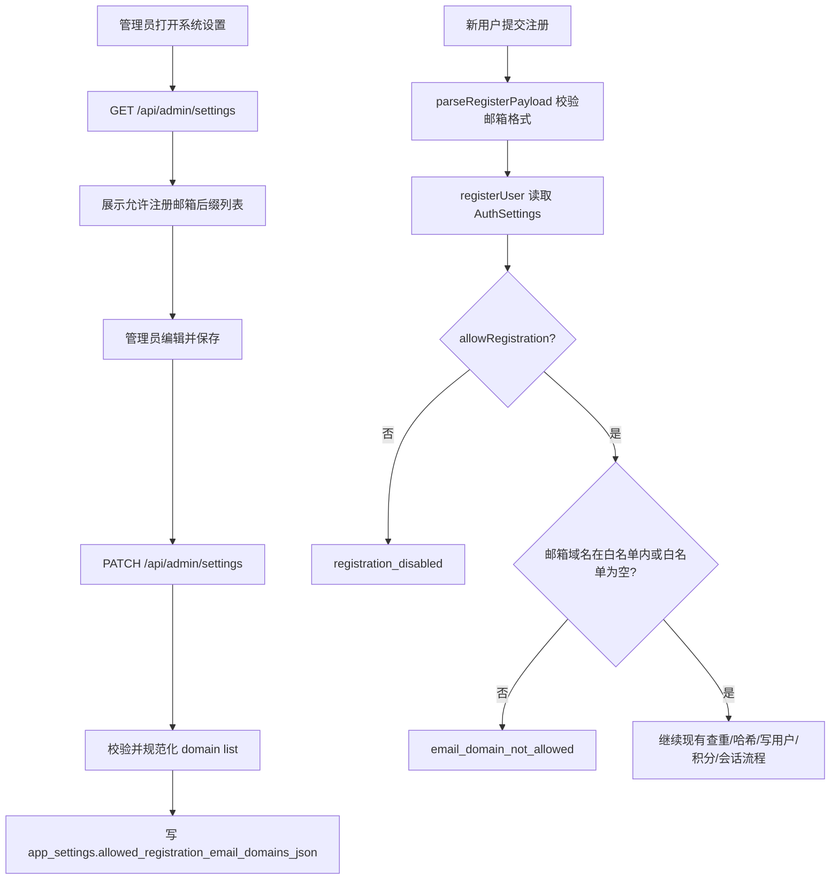

## 0. 术语约定

- 注册邮箱后缀白名单：用于限制新用户自助注册邮箱域名的列表。防冲突结论：代码里已有 `allowRegistration`、`requireApproval`、`defaultCredits` 等注册设置，本功能应作为 `app_settings` 的注册策略字段继续扩展，不另起账号策略子系统。
- 邮箱域名：邮箱 `@` 后面的完整小写域名，例如 `alice@qq.com` 的邮箱域名是 `qq.com`。防冲突结论：不使用模糊字符串后缀匹配，避免 `evilqq.com` 被误放行。
- 支持域名：管理员允许注册的邮箱域名项。防冲突结论：和 provider / Codex OAuth 里的账号邮箱无关，仅影响本地账号注册。

## 1. 决策与约束

### 需求摘要

为后台管理员增加“注册邮箱后缀白名单”配置。默认支持：

- `126.com`
- `139.com`
- `163.com`
- `189.cn`
- `aliyun.com`
- `gmail.com`
- `qq.com`

成功标准：

- 管理员能在系统设置里查看和保存允许注册的邮箱后缀列表。
- 新用户注册时，邮箱域名不在列表内会被拒绝，已支持域名仍按现有注册 / 审核 / 赠送积分链路继续走。
- 默认新库和迁移后的旧库都有上述默认列表。
- 注册失败返回稳定错误码，前端展示本地化错误文案，不泄露内部数据库细节。

明确不做：

- 不影响已有用户登录、管理员账号 bootstrap、Codex OAuth、provider 账号邮箱。
- 不做邮箱验证码、MX 查询、一次性邮箱检测、企业域名自动审批。
- 不支持通配符、正则、子域继承；`mail.qq.com` 不会因为 `qq.com` 自动放行。
- 不新增单独“禁用列表”；要禁止所有自助注册仍使用已有 `allowRegistration=false`。

假设：

- 管理员显式保存空白名单时表示“不限制邮箱域名”，用于临时开放注册；若需要“空列表阻止所有域名”，应改为用已有 `allowRegistration=false` 表达。
- 旧库缺失字段、字段为 `null`、或持久化 JSON 损坏时不按“不限制”处理，而是回退到默认 7 项列表，避免迁移或数据异常导致注册策略被放开。

### 复杂度档位

- 健壮性 = L3（偏离内部工具默认 L2 的原因：注册接口是未登录外部输入入口，必须完整校验并给稳定错误码）。
- 安全性 = validated（偏离 trusted 的原因：白名单来自管理端输入，注册邮箱来自匿名请求，二者都要规范化）。
- 可测试性 = tested（偏离 testable 的原因：注册拦截是账号边界，需要覆盖正常、错误和迁移默认值）。

### 关键决策

1. 白名单挂在 `app_settings`，而不是新建独立表。
   - 原因：当前注册开关、审核开关、注册送积分都在 `app_settings`，这是同一类全局注册策略。
   - 另一种做法：新表 `registration_email_domains`。名词层会多出列表实体和增删接口，当前需求不需要逐条审计或排序元数据。

2. 存储形态使用 JSON 字符串字段，API 暴露为 `string[]`。
   - 原因：SQLite / MySQL 现有设置行适合单字段扩展；API 层保持结构化数组，前端可用 textarea 或列表控件编辑。
   - 另一种做法：逗号字符串透传到前端。名词层会把解析责任推给 UI，错误边界分散。
   - 迁移约束：MySQL 的 `TEXT` 列不依赖数据库层默认值；新增列时允许应用层用默认列表兜底，初始化和保存路径显式写入规范化 JSON。

3. 域名匹配采用精确匹配，比较邮箱 `@` 后完整域名。
   - 原因：用户说“后缀支持列表”，但安全边界更适合精确域名，避免字符串 suffix 误判。
   - 另一种做法：`endsWith` 后缀匹配。会放大误放行风险，不采用。

4. 空列表表示不限制域名。
   - 原因：已有 `allowRegistration=false` 能表达“全部禁止”，空列表用于临时取消域名限制。
   - 另一种做法：空列表表示全部禁止。会和已有注册开关语义重叠，后台误清空时风险更高。

### 前置依赖

无。

## 2. 名词与编排

### 2.1 名词层

#### 现状

- `AuthSettings` 当前包含 `allowRegistration`、`requireApproval`、`defaultCredits`、`generationCreditCost`、`checkinCredit`、`maxImagesPerRequest`，由 `/api/auth/me` 返回给未登录页使用；来源：`packages/shared/src/auth.ts`、`apps/api/src/domain/auth/auth-store.ts`。
- `AdminSettings` 当前复用相同设置项，后台系统设置页通过 `/api/admin/settings` 读取和 PATCH；来源：`packages/shared/src/admin.ts`、`apps/api/src/domain/admin/admin-store.ts`、`apps/web/src/features/admin/AdminPage.tsx`。
- `app_settings` 当前持久化注册开关、审核开关、积分和生成数量限制；来源：`apps/api/src/infrastructure/schema.ts`、`sqlite-database.ts`、`mysql-database.ts`。
- 注册请求校验当前只校验名称、邮箱格式和密码长度；来源：`apps/api/src/server/http/validation.ts`。

#### 变化

- 新增共享常量 `DEFAULT_ALLOWED_REGISTRATION_EMAIL_DOMAINS`，值为用户给出的 7 个域名。
- `AuthSettings` / `AdminSettings` 增加 `allowedRegistrationEmailDomains: string[]`。
- `AdminSettingsUpdateRequest` 支持 PATCH `allowedRegistrationEmailDomains`。
- `app_settings` 增加 `allowed_registration_email_domains_json`，保存规范化后的 JSON 数组。
- 新增错误码 `email_domain_not_allowed`，注册域名不支持时返回稳定错误响应。
- 新增后端规范化规则：
  - trim、lowercase。
  - 允许管理员输入带 `@` 的项，存储前去掉前缀 `@`。
  - 只接受基本域名形态：label 由字母数字和 `-` 组成，至少一个点，label 不为空。
  - 去重，保留首次出现顺序。
- 新增后端读取规则：持久化字段缺失、为 `null`、不是数组 JSON、数组元素非法时，读取层回退默认 7 项列表；只有合法 JSON `[]` 表示管理员显式关闭域名限制。

#### 接口示例

```ts
// 来源：packages/shared/src/auth.ts AuthSettings
interface AuthSettings {
  allowRegistration: boolean;
  requireApproval: boolean;
  defaultCredits: number;
  generationCreditCost: number;
  checkinCredit: number;
  maxImagesPerRequest: number;
  allowedRegistrationEmailDomains: string[];
  adminConfigured: boolean;
}
```

```http
GET /api/auth/me
200 {
  "authenticated": false,
  "settings": {
    "allowRegistration": true,
    "requireApproval": false,
    "defaultCredits": 10,
    "generationCreditCost": 1,
    "checkinCredit": 1,
    "maxImagesPerRequest": 16,
    "allowedRegistrationEmailDomains": ["126.com", "139.com", "163.com", "189.cn", "aliyun.com", "gmail.com", "qq.com"],
    "adminConfigured": true
  }
}
```

```http
PATCH /api/admin/settings
{
  "allowedRegistrationEmailDomains": ["qq.com", "gmail.com"]
}

200 {
  "settings": {
    "...": "...",
    "allowedRegistrationEmailDomains": ["qq.com", "gmail.com"]
  }
}
```

```http
POST /api/auth/register
{
  "name": "User",
  "email": "user@example.com",
  "password": "password123"
}

403 {
  "error": {
    "code": "email_domain_not_allowed",
    "message": "当前邮箱后缀不支持注册。"
  }
}
```

### 2.2 编排层



#### 现状

注册主流程是线性分支：读取设置 → 检查开放注册 → 邮箱查重 → 密码哈希 → 写用户和注册赠送流水 → 按审核开关返回 pending 或会话。后台设置主流程也是线性：读取设置 → 前端编辑本地 state → PATCH 设置 → 后端归一化并持久化。

#### 变化

- 注册流程在 `allowRegistration` 之后、邮箱查重之前插入“邮箱域名白名单检查”。
- 后台设置流程新增一个字符串数组字段的读取、编辑、校验和持久化。
- `/api/auth/me` 继续返回 settings，使注册页可以展示支持的邮箱后缀，降低用户提交后才失败的概率。

#### 流程级约束

- 错误语义：注册邮箱域名不支持返回 403 + `email_domain_not_allowed`；管理端白名单格式错误返回 400 + `invalid_admin_settings`。
- 顺序约束：域名检查放在邮箱查重前，避免向不支持域名泄露“该邮箱是否已注册”的差异信息。
- 幂等性：重复保存同一组白名单得到相同持久化 JSON；重复注册不支持域名不产生用户或积分流水。
- 迁移安全：旧库补字段后，即使数据库里暂时没有实际 JSON 值，API 读取和注册校验也必须使用默认 7 项列表，而不是按空列表放开注册。
- 可观测点：只返回稳定错误码和用户可理解文案，不记录或返回原始内部 SQL / JSON 解析错误。

### 2.3 挂载点清单

- 数据库设置字段：`app_settings.allowed_registration_email_domains_json` — 新增。
- 共享契约字段：`AuthSettings.allowedRegistrationEmailDomains` / `AdminSettings.allowedRegistrationEmailDomains` — 新增。
- 注册策略入口：`registerUser` 读取设置后执行邮箱域名白名单检查 — 修改。
- 管理端设置接口：`/api/admin/settings` GET/PATCH 支持白名单数组 — 修改。
- 管理端系统设置 UI：后台“系统设置”页新增邮箱后缀列表编辑控件 — 修改。
- 注册页提示和错误文案：未登录注册页展示支持域名，API 错误码映射本地化文案 — 修改。

### 2.4 推进策略

1. 名词契约：扩展 shared auth/admin 类型、默认域名常量和错误码。
   - 退出信号：shared typecheck 通过，前后端能引用同一字段名。
2. 持久化骨架：给 SQLite/MySQL 的 `app_settings` 增加 JSON 字段和默认/迁移填充值。
   - 退出信号：新库初始化和旧库 ensureColumn 后都能读出默认白名单；MySQL 不依赖 `TEXT DEFAULT`。
3. 后端计算节点：实现域名列表规范化、设置读写归一化、注册时域名匹配。
   - 退出信号：支持域名注册继续原流程，不支持域名在创建用户前失败。
4. API 校验与错误语义：扩展 admin settings payload 校验和 auth 错误码映射。
   - 退出信号：无效白名单 PATCH 返回 `invalid_admin_settings`，不支持注册域名返回 `email_domain_not_allowed`。
5. 前端后台设置：系统设置页增加域名列表编辑控件，保存后回显规范化结果。
   - 退出信号：管理员可添加、删除、粘贴多行域名并保存。
6. 前端注册反馈：注册页展示支持域名提示，错误码本地化。
   - 退出信号：注册页能看到支持域名，不支持域名失败文案明确。
7. 验证：补充可执行检查和浏览器验证。
   - 退出信号：`pnpm typecheck`、`pnpm build` 通过；后台设置和注册失败路径浏览器可见。

### 2.5 结构健康度与微重构

##### 评估

- 文件级 — `apps/api/src/domain/auth/auth-store.ts`：689 行，已有认证设置、注册、登录、会话、管理员 bootstrap、旧数据回填等多个职责；本次会新增设置字段读取和注册检查，改动集中在既有注册策略路径。
- 文件级 — `apps/api/src/domain/admin/admin-store.ts`：677 行，已有用户管理、积分调整、设置、审计读取等职责；本次只扩展 settings 读写和归一化。
- 文件级 — `apps/api/src/server/http/validation.ts`：1199 行，集中放所有 HTTP payload 校验；本次只扩展 admin settings 校验。
- 文件级 — `apps/web/src/features/admin/AdminPage.tsx`：1128 行，用户、设置、审计、兑换码都在同一组件内；本次只在系统设置区域增加一个列表字段。
- 文件级 — `apps/web/src/shared/i18n/index.tsx`：2162 行，所有文案集中；本次新增少量 auth/admin 文案。
- 目录级 — `apps/api/src/domain/auth`：2 个文件，未摊平。
- 目录级 — `apps/web/src/features/admin`：1 个文件，未摊平但单文件偏胖。
- compound convention 检索：未命中目录组织 / 命名 / 归属相关 decision。

##### 结论：不做微重构

原因：本功能横跨设置契约、持久化、注册策略和后台 UI，必须触达多个既有入口；在 design 阶段做“只搬不改行为”的拆文件会引入额外 import churn，但不能明显降低本次白名单逻辑风险。实现时应把新计算逻辑尽量封装为小函数，避免继续扩大主流程函数。

##### 超出范围的观察

- `AdminPage.tsx` 同时承担多个后台 tab，已明显偏胖。建议后续走 `cs-refactor` 按 tab 或面板拆分，本 feature 不阻塞。
- `validation.ts` 是全局校验聚合文件，后续若继续增加后台设置项，建议走 `cs-refactor` 拆成按路由分组的 validation 模块，本 feature 不阻塞。

## 3. 验收契约

### 关键场景清单

1. 新库启动或迁移后读取 `/api/auth/me` → `settings.allowedRegistrationEmailDomains` 等于默认 7 项列表。
2. 管理员打开后台系统设置 → 能看到“注册邮箱后缀支持列表”，默认显示 7 项。
3. 管理员把列表改为 `qq.com`、`gmail.com` 并保存 → `/api/admin/settings` 返回规范化数组，刷新后仍为这两项。
4. 管理员输入 `@QQ.COM`、空行、重复项并保存 → 返回值规范化为 `qq.com`，重复项被去重。
5. 管理员输入非法域名如 `bad_domain` 并保存 → 返回 400 + `invalid_admin_settings`，原设置不被破坏。
6. 未登录用户用 `user@qq.com` 注册 → 继续走现有查重、哈希、积分、审核/会话流程。
7. 未登录用户用 `user@example.com` 注册，且列表不含 `example.com` → 返回 403 + `email_domain_not_allowed`，数据库不新增用户，也不写注册赠送积分流水。
8. 白名单为空时，任意格式合法邮箱仍可注册；要关闭所有注册由 `allowRegistration=false` 控制。
9. `allowRegistration=false` 时，不管邮箱域名是否支持，都返回现有 `registration_disabled` 语义。
10. 注册页处于注册模式时 → 用户能看到当前支持的邮箱后缀提示；不支持域名失败时显示本地化错误。
11. 旧库缺失 `allowed_registration_email_domains_json` 或字段值无法解析 → `/api/auth/me` 和注册校验都按默认 7 项列表执行，不应放开所有域名。

### 明确不做的反向核对项

- 代码中不应出现 MX 查询、邮箱验证码发送或 disposable email 服务调用。
- 已有用户登录流程不应读取或校验 `allowedRegistrationEmailDomains`。
- Codex OAuth/provider config 相关代码不应依赖本白名单。
- 不应出现 wildcard / regex 白名单配置项。

## 4. 与项目级架构文档的关系

- `ARCHITECTURE.md` 当前还是骨架。acceptance 阶段应把本地账号注册策略补入“核心概念 / 术语表”和“已知约束 / 硬边界”：注册策略由 `app_settings` 统一承载，包含开放注册、审核、注册送积分、邮箱后缀白名单。
- `docs/SECURITY.md` 已声明本地账号登录边界和 session cookie 约束。本 feature 不改变登录边界，但新增匿名注册入口的输入校验规则；acceptance 阶段可补一句“注册邮箱域名白名单只限制新注册，不影响已有账号登录”。
- `docs/generated/db-schema.md` 需要随 `app_settings` 新字段同步更新。
