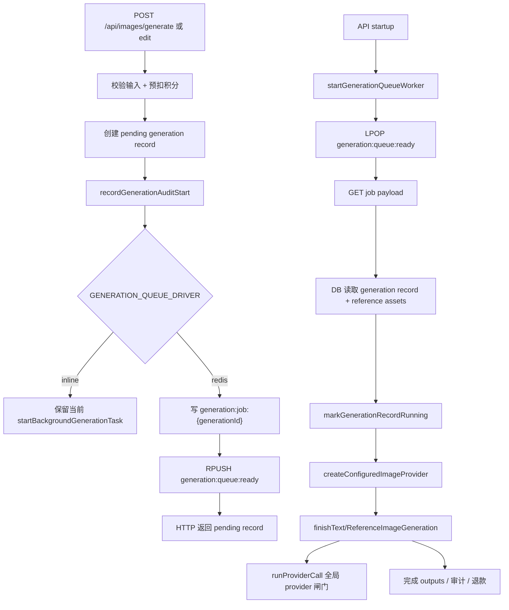

## 0. 术语约定

- generation queue job：Redis 中的一条手动生成任务运行态，指向一个 `generation_records.id`。防冲突结论：本 feature 先做 generation 级 job，不把 prompt、reference bytes 或完整 provider input 放进 Redis。
- generation queue worker：API 进程内后台循环，从 Redis ready 队列取 job，重建 provider input，再调用现有 `finishTextToImageGeneration` / `finishReferenceImageGeneration`。
- pending generation record：已预扣积分、已创建 DB generation record、已入队或等待 worker 消费的记录。防冲突结论：不是 Agent plan job 的 `queued` 状态。
- running generation record：worker 已开始处理的记录；进程中断时可按现有 interrupted 语义失败收敛。
- inline task path：`GENERATION_QUEUE_DRIVER=inline` 时保留当前进程内 background task，供 smoke 和显式本地调试使用。

## 1. 决策与约束

### 需求摘要

`provider-global-semaphore` 已限制真正打到 provider 的总并发，但手动生成请求仍会在 HTTP 入口直接启动一个进程内 background task。100 个任务每个 16 张时，虽然 provider call 会排队，但 API 进程仍会同时堆出 100 个 generation task 和大量等待中的 output promise。本 feature 把手动文生图和参考图编辑改成 Redis 队列驱动：请求只负责预扣积分、创建 `pending` record、写审计起始记录和入队；worker 消费队列后再执行原有生成收敛。

成功标准：

- `GENERATION_QUEUE_DRIVER=redis` 时，手动 `/api/images/generate` 和 `/api/images/edit` 不再直接启动 `startBackgroundGenerationTask`，而是创建 `pending` record 并入队。
- API 进程启动 generation queue worker，从 Redis ready 队列消费 job，并在处理前把 record 从 `pending` 推到 `running`。
- worker 执行生成时继续复用 `finishTextToImageGeneration` / `finishReferenceImageGeneration`，因此 provider call 仍通过 `runProviderCall` 全局闸门。
- Redis job 不保存 prompt、reference image bytes、API key、provider credential、audit payload、credit transaction 或完整 generation record。
- `GENERATION_QUEUE_DRIVER=inline` 继续走现有进程内 background task，避免现有 smoke 测试依赖 Redis worker。

明确不做：

- 不实现 per-output Redis job、delayed retry、指数退避、错误分类或 maxAttempts 重试。
- 不让 Agent 生成进入队列；Agent 接入仍由后续 `agent-generation-scheduler-adapter` 处理。
- 不新增前端队列 UI、admin queue monitor 或实时排队位次。
- 不处理 Redis ready 队列丢失后的 DB pending record 恢复；取消恢复属于后续 `generation-cancel-and-recovery`。
- 不改变积分价格、最大图片数、provider 选择顺序或已有公开 Gallery 读取规则。

### 复杂度档位

- 健壮性 = L3：Redis driver 下入队失败不能静默退回直接执行；必须失败收敛并退款。
- 结构 = modules：新增独立 generation queue 模块，避免把 Redis list worker 逻辑塞进 `generation-tasks.ts`。
- 安全性 = validated：Redis job payload 只保存短期协调字段，不保存 prompt 或引用图 bytes。
- 可测试性 = tested：新增 queue smoke 覆盖 enqueue、worker 消费、并发上限和 job 清理。
- Concurrency = distributed：Redis ready list 可被多个 API 进程 worker 共享消费；inline 仍只保证单进程调试语义。

### 关键决策

1. 本 feature 先做 generation 级 job，不做 per-output job。
   - 原因：现有 DB 以 generation record 作为完成、审计和退款的事实收敛点。per-output job 需要增量 output 幂等写入、最终完成竞争处理和取消恢复，风险更接近后续 `generation-state-bridge`。
   - 另一种做法：直接按 roadmap 4.3 做 output job。会把本 feature 扩成队列 + 状态桥 + 幂等退款三件事，不利于先切断 HTTP 入口大量 background task。

2. Redis job payload 只保存 `jobId`、`generationId`、`userId`、`mode`、`isPublic`、`attempt`、`maxAttempts`、`enqueuedAt`。
   - 原因：worker 可从 DB generation record 和 reference asset rows 重建 provider input；`isPublic` 当前只存在请求输入和 audit 中，作为输出可见性运行态随 job 传递。
   - 另一种做法：把完整 provider input 放入 Redis。会保存 prompt 和 reference bytes，违反安全边界。

3. worker 使用 polling `LPOP`，不使用阻塞 `BLPOP`。
   - 原因：当前 `getRedisClient()` 返回 singleton，阻塞命令会占住连接并影响 provider scheduler；polling 足够支撑本地工作站场景。
   - 另一种做法：为 worker duplicate Redis client。需要扩展 Redis runtime 生命周期，留到队列复杂度上升时再评估。

4. Redis 模式启动时只把 `running` generation 标记为 interrupted failed，不标记 `pending`。
   - 原因：`pending` 可能已经在 Redis ready 队列里，启动后 worker 仍可消费；`running` 代表上次进程中断时正在执行。
   - 另一种做法：继续失败 `pending` 和 `running`。会让重启后 Redis ready 队列中的 pending job 全部失效。

## 2. 名词与编排

### 2.1 名词层

#### 现状

- `apps/api/src/domain/generation/generation-tasks.ts` 的 `startTextToImageGenerationTask` / `startReferenceImageGenerationTask` 在创建 running record 后立即调用 `startBackgroundGenerationTask`。
- `activeGenerationTasks` 只记录当前进程内 AbortController，用于取消正在执行的 background task，不是队列。
- `createRunningTextToImageGeneration` / `createRunningReferenceImageGeneration` 固定创建 `status="running"` 的 generation record。
- `finishTextToImageGeneration` / `finishReferenceImageGeneration` 已能基于 generation id 完成 DB outputs、审计和退款收敛。
- `GenerationStatus` 已包含 `pending`，前端轮询已把 `pending` 视为 active。

#### 变化

新增 generation queue job：

```ts
type GenerationQueueMode = "generate" | "edit";

interface GenerationQueueJob {
  jobId: string;
  generationId: string;
  userId: string;
  mode: GenerationQueueMode;
  isPublic: boolean;
  attempt: number;
  maxAttempts: number;
  enqueuedAt: string;
}
```

新增 generation queue worker 配置：

```text
GENERATION_QUEUE_WORKER_CONCURRENCY=2
GENERATION_QUEUE_POLL_INTERVAL_MS=250
```

新增 Redis key：

```text
generation:queue:ready
generation:job:{generationId}
```

新增或调整 API：

```ts
function readGenerationQueueConfig(env: NodeJS.ProcessEnv): GenerationQueueConfig;
async function enqueueGenerationJob(job: GenerationQueueJob): Promise<void>;
function startGenerationQueueWorker(processor: GenerationQueueProcessor): void;
async function stopGenerationQueueWorker(): Promise<void>;
async function markGenerationRecordRunning(generationId: string): Promise<GenerationRecord | undefined>;
```

### 2.2 编排层



#### 现状

手动生成 route 调用 `start*GenerationTask` 后，HTTP 请求只等待创建 record 和启动 background task。真正 provider 调用在当前进程的 async IIFE 中执行。API 重启时 `initializeGenerationTaskManager()` 会将 pending/running generation 标记为 interrupted failed。

#### 变化

- Redis driver 下，`start*GenerationTask` 创建 `pending` record 并 enqueue job 后立即返回。
- `initializeGenerationTaskManager()` 在 Redis driver 下启动 queue worker，并只失败收敛上次中断的 `running` record。
- queue worker 从 DB 读取 generation record，文生图从 record 字段重建 `ImageProviderInput`；参考图编辑额外从 `generation_reference_assets` 和 asset storage 重建 `ReferenceImageInput[]`。
- worker 开始执行前将 record 标记为 `running`，并注册当前进程的 AbortController 到 `activeGenerationTasks`，使取消可 abort in-flight provider call。
- worker 完成后删除 Redis job key；若 record 已 terminal（例如用户取消），worker 跳过并删除 job key。

#### 流程级约束

- 并发语义：`GENERATION_QUEUE_WORKER_CONCURRENCY` 限制当前 API 进程同时处理的 generation job 数；真正 provider API 并发仍由 `GENERATION_PROVIDER_GLOBAL_CONCURRENCY` 限制。
- 错误语义：入队失败时不能直接执行 provider；应把 generation 标记 failed，并通过现有失败路径退款。
- 取消语义：取消 pending record 只更新 DB 状态；后续 worker 取到 job 时发现 terminal 后跳过。取消 running record 通过 `activeGenerationTasks` abort 当前 worker。
- 安全边界：Redis job 不保存 prompt、reference bytes、API key、provider credential、audit payload、credit transaction 或完整 generation record。
- 扩展点：后续 per-output queue、retry policy 和 cancellation recovery 应复用 queue module，不另开 Redis queue key 协议。

### 2.3 挂载点清单

- Generation queue 模块：新增 `apps/api/src/domain/generation/generation-queue.ts`。
- 手动生成任务入口：`apps/api/src/domain/generation/generation-tasks.ts` 在 Redis driver 下 enqueue job，在 inline driver 下保留旧 background task。
- 生成记录状态能力：`image-generation.ts` / `storage/store.ts` 支持创建 `pending` record、标记 `running`，以及启动时只失败 running interrupted records。
- 进程生命周期：API 启动初始化 worker，shutdown 停止 worker 后关闭 Redis client。
- 配置与文档：`.env.example`、`docker-compose.yml`、`docs/RELIABILITY.md`、`docs/SECURITY.md` 说明 queue worker 配置和 Redis payload 安全边界。
- 测试入口：新增 generation queue smoke，验证 Redis queue enqueue/worker 消费/job 清理。
- Roadmap 状态：`generation-queue-worker` 从 `planned` 改为 `in-progress`。

### 2.4 推进策略

1. 名词契约：新增 queue config、job 类型、Redis key 协议和 worker 生命周期 API。
   - 退出信号：配置默认值/非法值解析稳定，enqueue 写入 ready list 和 job key。
2. 状态能力：支持 pending record、running 标记和 Redis 启动时只失败 interrupted running。
   - 退出信号：manual generation smoke 能观察 pending -> running/terminal 路径。
3. Worker 编排：实现 Redis worker poll、job parse、record 重建、provider execution 和 job cleanup。
   - 退出信号：worker 能消费 fake job，遵守 worker concurrency，并清理 Redis job key。
4. 手动入口接入：Redis driver 下 start generate/edit 改为 enqueue；inline driver 保持旧 background task。
   - 退出信号：grep 显示直接 background task 只在 inline 分支使用。
5. 配置与文档：更新 env、Docker、可靠性和安全文档。
   - 退出信号：worker 并发、polling、inline 限制和 Redis 不保存敏感数据被记录。
6. 验证：运行 typecheck/build、queue smoke、provider scheduler smoke、executor/planner smoke。
   - 退出信号：新旧关键 smoke 通过，Redis ready list/job key 无测试残留。

### 2.5 结构健康度与微重构

##### 评估

- compound convention：未命中目录组织 / 命名 / 归属类 decision；已有 concurrency 探索确认 `generation-tasks.ts` 是手动生成 background task 的入口。
- 文件级 — `apps/api/src/domain/generation/generation-tasks.ts`：约 240 行，职责是生成任务编排；本次只保留路由级 orchestration，Redis queue worker 细节放新文件。
- 文件级 — `apps/api/src/domain/generation/image-generation.ts`：约 960 行，职责偏大；本次只加状态入口和 record 重建所需小型导出，不做大拆分。
- 文件级 — `apps/api/src/infrastructure/redis-runtime.ts`：仍只负责 client 生命周期，不放 queue key 协议。
- 目录级 — `apps/api/src/domain/generation`：已有 `image-generation.ts`、`generation-tasks.ts`、`provider-scheduler.ts`，新增 `generation-queue.ts` 属于同域调度能力，未达到需要重组目录的程度。

##### 结论：不做微重构

原因：把 Redis queue worker 放到独立 `generation-queue.ts` 已经能阻止 `generation-tasks.ts` 继续膨胀；拆 `image-generation.ts` 会混入行为不变的大重构，不作为本 feature 前置。后续如果 per-output state bridge 落地时继续增加状态函数，可单独评估拆出 `generation-records.ts` / `generation-output-runner.ts`。

## 3. 验收契约

### 关键场景清单

1. `GENERATION_QUEUE_DRIVER=redis` 启动 API task manager -> queue worker 启动，且不会把 `pending` generation 标记为 interrupted failed。
2. 手动文生图请求 -> 创建 `pending` record、预扣积分、写 audit start、写 Redis job，HTTP 返回时 provider 尚未被调用。
3. worker 消费文生图 job -> record 变 `running`，随后进入 `finishTextToImageGeneration`，provider call 仍受 `runProviderCall` 闸门控制，最终 record terminal。
4. 手动参考图编辑请求 -> Redis job 不包含 reference bytes；worker 从 DB reference asset 读取 bytes 并完成 edit generation。
5. 用户取消 pending generation -> DB record 变 `cancelled`；worker 后续取到 job 时跳过 provider 并清理 Redis job key。
6. worker 正在执行 generation 时取消 -> `activeGenerationTasks` abort 当前 signal，最终按 existing cancel 语义收敛。
7. 入队失败 -> 不绕过队列直接执行 provider；record 失败收敛并退款。
8. queue worker 并发设置为 1，连续入队多个 job -> 观测到 processor 最大 active 数不超过 1。

### 明确不做的反向核对项

- 不新增 `generation:queue:delayed`、retry attempt zset、指数退避或错误分类。
- 不把 prompt、API key、reference image bytes、provider credential、audit payload 或 credit transaction 写入 Redis。
- 不改 Agent executor 生成路径为 Redis queue。
- 不新增前端队列状态 UI 或 admin queue monitor。

## 4. 与项目级架构文档的关系

acceptance 阶段应把以下内容提炼回 architecture：

- Redis 模式下手动生成入口现在先创建 pending record 并进入 generation queue。
- generation queue worker 是 API 进程内消费者，worker 并发由 `GENERATION_QUEUE_WORKER_CONCURRENCY` 控制；provider API 并发仍由 provider scheduler 控制。
- Redis 保存 queue ready list 和 job 指针/payload；DB 仍保存 generation record、outputs、audit、assets 和 credit transaction 事实。
- inline driver 只保留旧进程内 background task，用于 smoke 和显式本地调试。
