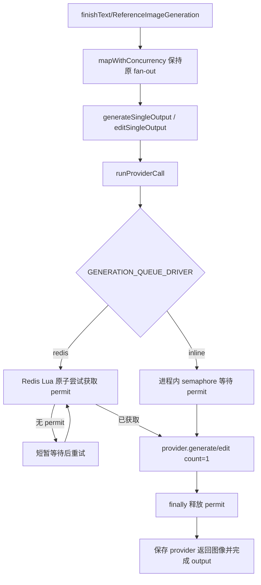

## 0. 术语约定

- provider call：一次实际打到图片 provider 的 API 调用，即 `provider.generate(... count: 1)` 或 `provider.edit(... count: 1)`。防冲突结论：不是 generation record，不是单个 HTTP 请求，也不是 Agent job。
- 全局 provider 并发闸门：所有 API 进程共享的一组 Redis permit，限制同一时刻进入 provider call 的总数。防冲突结论：不是 `BATCH_CONCURRENCY`，不是 `AGENT_JOB_CONCURRENCY`。
- provider permit：一次 provider call 执行前获得的租约，完成、失败或取消后释放；进程崩溃时靠 TTL 自动过期。
- inline scheduler：`GENERATION_QUEUE_DRIVER=inline` 时使用的进程内 semaphore，仅用于测试或显式本地调试，不提供跨进程全局保证。
- permit wait：没有空闲 permit 时在 provider call 前等待并轮询，形成最小排队语义。防冲突结论：不是后续 `generation-queue-worker` 的持久化 Redis 队列。

## 1. 决策与约束

### 需求摘要

当前单个生成任务内部最多 2 个 provider call 并发，但多个任务和 Agent run 会叠加。只有一个 provider 时，100 个任务每个 16 张会让 provider 面对最高约 200 个同时请求。本 feature 要先形成最小闭环：所有手动文生图、参考图编辑和 Agent 生成最终进入同一个 provider call 闸门，同时打到 provider 的请求数不超过 `GENERATION_PROVIDER_GLOBAL_CONCURRENCY`。

成功标准：

- `GENERATION_PROVIDER_GLOBAL_CONCURRENCY` 默认 2，可通过环境变量配置。
- `GENERATION_QUEUE_DRIVER=redis` 时，provider call 必须先通过 Redis semaphore 获取 permit；没有 permit 时等待，不绕过。
- `GENERATION_QUEUE_DRIVER=inline` 时，使用进程内 semaphore，现有 smoke 测试无需本地 Redis 也能验证并发逻辑。
- 所有 `provider.generate` / `provider.edit` 调用都通过 `runProviderCall`，手动生成和 Agent 路径都覆盖。
- provider call 完成、失败或取消后释放 permit；进程崩溃时 permit 通过 TTL 过期。

明确不做：

- 不实现 Redis generation queue、worker、delayed retry、错误分类或重试策略。
- 不改变 `BATCH_CONCURRENCY=2` 和 `AGENT_JOB_CONCURRENCY=2` 的本地 fan-out 结构；闸门只包住实际 provider call。
- 不做多 provider 负载均衡、权重路由、provider 级别独立限额或自动 failover。
- 不把 prompt、reference image bytes、API key、generation record、audit 或 credit transaction 写进 Redis。
- 不新增前端队列状态、排队进度 UI 或后台监控大盘。

### 复杂度档位

- 健壮性 = L3：provider 闸门失败不能静默放开并发。
- 结构 = modules：新增独立 provider scheduler 模块，避免把 Redis semaphore 逻辑写进 `image-generation.ts`。
- 安全性 = validated：Redis key 和 permit member 不保存 prompt、API key 或用户输入。
- 可测试性 = tested：用 inline scheduler smoke 验证并发上限，用类型检查覆盖 Redis scheduler 接口。
- Concurrency = distributed：redis driver 使用 Redis Lua 脚本原子获取 permit；inline driver 只保证进程内。

### 关键决策

1. provider scheduler 落在 `apps/api/src/domain/generation/provider-scheduler.ts`。
   - 原因：它包装的是 generation 域内的 provider call，直接被 `image-generation.ts` 使用；Redis client 仍通过 `redis-runtime.ts` 取得。
   - 另一种做法：放在 `infrastructure/redis-provider-semaphore.ts`。会让 generation 域还需要另一个调度入口层，当前最小闭环不需要。

2. Redis semaphore 使用 sorted set + Lua 原子脚本。
   - 原因：一次脚本内清理过期 permit、计数、写入新 permit，避免多进程竞态超发。
   - 另一种做法：先 `ZCARD` 再 `ZADD`。并发下会超发，不采用。

3. permit TTL 默认 30 分钟，配置为 `GENERATION_PROVIDER_PERMIT_TTL_MS`。
   - 原因：当前 OpenAI 图片调用默认 timeout 是 20 分钟，30 分钟覆盖正常调用，同时能在 worker 崩溃后释放槽位。
   - 另一种做法：无 TTL 的 set。崩溃会永久占用并发槽，不采用。

4. 没有 permit 时在 provider call 前等待轮询。
   - 原因：本 feature 要先把高并发压到配置值内；持久队列还没实现，等待式最小排队能保持现有请求/后台任务模型不变。
   - 另一种做法：立即失败。会把高并发从上游限流变成本应用错误，不符合“排队机制”的方向。

## 2. 名词与编排

### 2.1 名词层

#### 现状

- `apps/api/src/domain/generation/image-generation.ts` 中 `generateSingleOutput` 直接调用 `provider.generate({ count: 1 })`，`editSingleOutput` 直接调用 `provider.edit({ count: 1 })`。
- 单任务 fan-out 由 `BATCH_CONCURRENCY = 2` 控制；多个 generation task 之间没有共享闸门。
- Agent 通过 `apps/api/src/domain/generation/generation-tasks.ts` 的 `runTextToImageGenerationTask` / `runReferenceImageGenerationTask` 回到同一 `finish*Generation` 流程，因此只要包住 `image-generation.ts` 的 provider call，Agent 路径也会覆盖。
- Redis runtime 已提供 `getRedisClient()` 和 `redisRuntimeUsesRedis()`。

#### 变化

新增 provider scheduler 配置：

```ts
interface ProviderSchedulerConfig {
  globalConcurrency: number;
  permitTtlMs: number;
}
```

新增 provider scheduler API：

```ts
type ProviderCallMode = "generate" | "edit";

interface ProviderCallInput<T> {
  generationId: string;
  outputId: string;
  outputIndex: number;
  mode: ProviderCallMode;
  signal?: AbortSignal;
  call: (signal?: AbortSignal) => Promise<T>;
}

function readProviderSchedulerConfig(env: NodeJS.ProcessEnv): ProviderSchedulerConfig;
async function runProviderCall<T>(input: ProviderCallInput<T>): Promise<T>;
```

新增环境变量：

```text
GENERATION_PROVIDER_GLOBAL_CONCURRENCY=2
GENERATION_PROVIDER_PERMIT_TTL_MS=1800000
```

Redis key：

```text
generation:provider:permits
```

key 的 member 只包含随机 permit id，不包含 prompt、API key、reference image bytes、generation id、output id、用户输入或完整用户数据。

### 2.2 编排层



#### 现状

手动生成和 Agent 都会进入 `finishTextToImageGeneration` / `finishReferenceImageGeneration`。这两个函数对输出索引用 `mapWithConcurrency(..., BATCH_CONCURRENCY)` 并发执行；单个输出函数直接调用 provider，然后保存图片资产。

#### 变化

- 新增 `runProviderCall`，所有 `provider.generate` 和 `provider.edit` 只在该函数获得 permit 后执行。
- `generateSingleOutput` / `editSingleOutput` 继续负责 output id、错误收敛和图片保存，但 provider API 调用改为通过 scheduler。
- `runTextToImageGeneration` / `runReferenceImageGeneration` 为非 running-record 路径提前生成 generation id，便于 provider call 记录 permit member；持久化 id 与该 id 保持一致。
- Redis driver 使用 Lua 脚本做 acquire：清理过期 permit → 当前数小于上限才写入本次 permit → 设置 key TTL。
- release 使用 `ZREM`，并在 `finally` 中执行；release 失败不重试，不阻断 provider 结果收敛。

#### 流程级约束

- 并发语义：上限限制的是整个应用同时进入 provider API 的 call 数；一个 `count=16` 任务仍拆成 16 次 output call，但全局同时打到 provider 的 output call 不超过配置值。
- 错误语义：Redis driver 无法获取 Redis client 或 Redis 命令失败时抛稳定 `ProviderSchedulerError`，不能直接绕过闸门打 provider。
- 取消语义：等待 permit 时若 `AbortSignal` 已取消，立即抛 `AbortError`；provider call 内继续传递同一个 signal。
- 幂等性：release 多次调用或释放已过期 permit 应安全返回。
- 安全边界：Redis key/member 不保存 prompt、API key、reference image bytes、provider credential、generation id、output id 或完整用户数据。
- 扩展点：后续 queue worker 和 retry policy 继续复用 `runProviderCall`，不得另开 provider 调用通道。

### 2.3 挂载点清单

- Provider scheduler 模块：新增 `apps/api/src/domain/generation/provider-scheduler.ts`。
- Provider call 接入：`apps/api/src/domain/generation/image-generation.ts` 的 `provider.generate` / `provider.edit` 改为通过 `runProviderCall`。
- 运行配置：`.env.example`、`docker-compose.yml`、`docs/RELIABILITY.md`、`docs/SECURITY.md` 增加全局 provider 并发与 permit TTL 说明。
- 测试入口：新增 provider scheduler smoke，验证 inline semaphore 的并发上限、排队等待、失败释放。
- Roadmap 状态：`provider-global-semaphore` 从 `planned` 改为 `in-progress`。

### 2.4 推进策略

1. 名词契约：新增 provider scheduler 配置解析、inline semaphore 和公开 `runProviderCall` API。
   - 退出信号：非法/缺省 env 能得到确定配置，inline 模式可限制并发。
2. Redis permit：实现 Redis Lua acquire 和 release，复用 `redis-runtime.ts`。
   - 退出信号：Redis driver 下 acquire 原子执行，release 使用 permit id 清理。
3. Provider 接入：把 text/edit 两个 provider call 全部包进 `runProviderCall`。
   - 退出信号：grep 中不再有未包装的 `provider.generate` / `provider.edit` 调用点。
4. 配置与文档：更新 env、Docker、可靠性和安全文档。
   - 退出信号：默认并发数、TTL、inline 限制和 Redis 不保存敏感数据被记录。
5. 验证：新增 smoke 并运行 typecheck/build/smoke。
   - 退出信号：provider scheduler smoke 证明并发不超过配置值；现有 generation/Agent smoke 通过。

### 2.5 结构健康度与微重构

##### 评估

- compound convention：未发现目录组织或命名约定类 decision 与 provider scheduler 冲突。
- 文件级 — `apps/api/src/domain/generation/image-generation.ts`：当前约 900 行，职责偏多；本次只改 provider call 的最小调用点，不在文件内新增 Redis semaphore 逻辑。
- 文件级 — `apps/api/src/infrastructure/redis-runtime.ts`：只负责 Redis client 生命周期；本次不把 provider semaphore 写进去，避免 Redis runtime 承担业务调度。
- 文件级 — `apps/api/src/domain/generation/generation-tasks.ts`：Agent 和手动任务都已回到 `image-generation.ts`，本次无需改任务管理流程。
- 目录级 — `apps/api/src/domain/generation`：当前只有 generation task 和 image generation 相关文件，新增 `provider-scheduler.ts` 属于同域能力。

##### 结论：不做微重构

原因：`image-generation.ts` 偏大，但当前 feature 可以通过新增独立 scheduler 文件和极少量调用点替换完成；拆分 `image-generation.ts` 会混入行为不变的结构改动，增加 review 风险。后续如继续做 queue/state bridge，可另起 refactor 或在对应 feature 评估拆分。

## 3. 验收契约

### 关键场景清单

1. 未设置 provider scheduler env，`GENERATION_QUEUE_DRIVER=inline` → `runProviderCall` 默认最多 2 个并发，5 个并发任务会排队完成且观测到的最大 active 数不超过 2。
2. 设置 `GENERATION_PROVIDER_GLOBAL_CONCURRENCY=1` → 同时触发多个 provider call 时，同一时刻只有 1 个 call 进入 fake provider。
3. provider call 抛错 → permit 在 `finally` 中释放，后续 call 能继续获得 permit。
4. 等待 permit 时 `AbortSignal` 取消 → 等待中的 call 抛 `AbortError`，不进入 provider。
5. `GENERATION_QUEUE_DRIVER=redis` 且 Redis 可用 → 多个并发 `runProviderCall` 不超过 `GENERATION_PROVIDER_GLOBAL_CONCURRENCY`，完成后 Redis permit key 不残留当前 permit。
6. 手动文生图、参考图编辑和 Agent 生成路径都通过同一个 scheduler；grep 不存在未包装的 `provider.generate` / `provider.edit` 调用点。
7. 100 个任务每个 16 张的情况下，虽然仍会创建 1600 个 output call，但同时进入 provider API 的 call 数由 `GENERATION_PROVIDER_GLOBAL_CONCURRENCY` 限制。

### 明确不做的反向核对项

- 不新增 `generation:queue:*` ready/delayed/job 队列实现。
- 不新增 provider retry、指数退避、错误分类或 delayed retry key。
- 不把 prompt、API key、reference image bytes、generation record、audit 或 credit transaction 写入 Redis。
- 不新增前端 queue UI、admin monitor 或 provider 状态面板。

## 4. 与项目级架构文档的关系

acceptance 阶段应把以下内容提炼回 architecture：

- `provider-global-semaphore` 已成为所有图片 provider call 的唯一入口。
- `GENERATION_PROVIDER_GLOBAL_CONCURRENCY` 限制整个应用打到当前 provider 的总并发请求数，不是单任务/单用户/worker 并发。
- Redis 保存短期 provider permit，数据库仍保存生成事实状态。
- `GENERATION_QUEUE_DRIVER=inline` 只提供进程内测试/调试限制，不提供跨进程全局保证。
