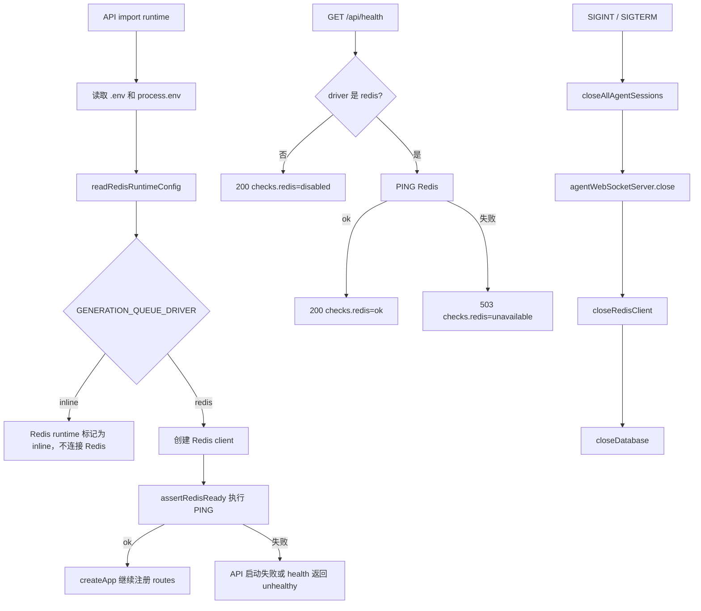

## 0. 术语约定

- Redis runtime：API 进程内统一的 Redis 连接、配置读取、健康检查和关闭入口。防冲突结论：不同于后续 Redis 队列、锁或 semaphore 业务模块；本 feature 只提供底座。
- queue driver：生成调度运行模式，取值 `redis` 或 `inline`。防冲突结论：`inline` 是测试/显式本地调试替身，不是当前生产默认，也不表示继续允许无限并发。
- 全局 provider 并发数：整个应用同一时刻允许打到当前图片 provider 的 provider API 请求总数。防冲突结论：不是单个生成任务的 `BATCH_CONCURRENCY`，不是单用户并发，也不是 worker 数；实际限制逻辑在后续 `provider-global-semaphore` feature 中实现。
- 本地 Redis：用户已确认本地使用 `localhost:6379`，无密码。防冲突结论：本地默认可无密码；远程 Redis 的 ACL/TLS/网络隔离不在本 feature 内实现。
- Redis 健康检查：API 对 Redis 连接可用性的主动验证。防冲突结论：不等同于 provider 健康检查；provider 可用性仍由现有 provider 配置链路处理。

## 1. 决策与约束

### 需求摘要

为后续 provider 全局并发闸门、队列和重试机制接入 Redis runtime。API 能读取 Redis 配置，默认连接本地无密码 Redis，启动和健康检查能明确反映 Redis 是否可用，测试可以显式使用 inline driver 避免依赖本机 Redis。

成功标准：

- 默认 `REDIS_URL` 为 `redis://127.0.0.1:6379`，本地无密码 Redis 可直接使用。
- `GENERATION_QUEUE_DRIVER=redis` 时 Redis 不可用，API 启动失败或 `/api/health` 返回不健康，不静默退回旧的无限并发行为。
- `GENERATION_QUEUE_DRIVER=inline` 时 Redis client 不连接，用于 smoke/unit 测试和显式本地调试。
- API 关闭时 Redis 连接能被关闭，避免 watch/dev 或测试进程残留句柄。
- `.env.example`、Docker Compose 和可靠性/安全文档说明本地无密码 Redis 只应绑定本机或受控网络。

明确不做：

- 不实现 provider semaphore、队列、worker、retry 或 Redis key 协议；这些属于后续 roadmap item。
- 不让 `redis-runtime-foundation` 直接限制 provider 并发；本条只提供 Redis 连接底座，`GENERATION_PROVIDER_GLOBAL_CONCURRENCY` 的执行语义由 `provider-global-semaphore` 落地。
- 不把生成记录、输出、审计、积分或验证码迁移到 Redis。
- 不做 Redis 管理 UI、监控大盘、ACL/TLS 配置生成或远程部署加固。
- 不在健康检查响应里暴露 Redis URL、密码、主机内网拓扑或连接错误细节。

### 复杂度档位

- 健壮性 = L3（偏离内部工具默认 L2 的原因：Redis 将成为生成调度必需依赖，启动失败和健康检查必须明确，不能降级成高并发旧路径）。
- 结构 = modules（偏离 functions 的原因：Redis runtime 会被后续 semaphore、queue、retry 多个 feature 复用，不能散落在 route 或 generation 模块里）。
- 安全性 = validated（偏离 trusted 的原因：`REDIS_URL` 来自运行时环境，health endpoint 是匿名可访问路径，必须避免泄露凭据）。
- 可测试性 = tested（偏离 testable 的原因：后续所有生成调度依赖此底座，需要覆盖 redis/inline 两种配置解析和健康语义）。
- Concurrency = distributed（特殊维度；本 feature 只接入分布式依赖底座，真正的分布式锁/permit 在后续 `provider-global-semaphore` 实现）。

### 关键决策

1. 使用 `redis` npm package（node-redis）作为 API 依赖，不使用 Upstash HTTP Redis。
   - 原因：用户指定本地 `localhost:6379` 无密码 Redis；后续 semaphore/queue 需要低延迟 Redis primitives。
   - 另一种做法：使用 pnpm-lock 中已有的传递依赖 `@upstash/redis`。名词层会绑定 HTTP/token 模式，不符合本地无密码 Redis。

2. Redis runtime 放在 `apps/api/src/infrastructure/redis-runtime.ts`。
   - 原因：现有 `infrastructure/runtime.ts` 负责路径和 server 配置，`database.ts` / `asset-storage.ts` 各自封装外部运行时依赖；Redis 是同级基础设施依赖。
   - 另一种做法：直接写进 `generation-tasks.ts`。会让后续队列、semaphore 和健康检查都依赖 generation 模块，边界不清。

3. 默认 driver 是 `redis`，测试必须显式选择 `inline`。
   - 原因：用户已经拍板 Redis 要加，默认继续 inline 会掩盖真实运行依赖。
   - 另一种做法：Redis 不可用时自动 inline。会让高并发风险在部署时静默回归，不采用。

4. `/api/health` 包含 Redis 结果，但不暴露配置细节。
   - 原因：健康检查需要让部署和开发者看到 Redis 不可用；该 endpoint 匿名可访问，不能泄露 URL 或密码。
   - 另一种做法：新增 `/api/ready`。会增加一个额外挂载点；当前已有 health endpoint 足够承载最小信号。

### 前置依赖

- 本地开发机需要运行 Redis，监听 `127.0.0.1:6379` 或 `localhost:6379`，无密码。
- 实现阶段需要给 API workspace 增加 Redis client 依赖并更新 lockfile。

## 2. 名词与编排

### 2.1 名词层

#### 现状

- API 运行时配置集中在 `apps/api/src/infrastructure/runtime.ts`，当前只解析路径、HOST/PORT 和 SQLite journal/locking 模式。
- API 外部依赖目前有数据库和资产存储：`database.ts` 暴露 `closeDatabase()`，`asset-storage.ts` 暴露配置断言。Redis 尚未接入。
- `/api/health` 当前只返回 `{ status: "ok" }`，不检查数据库、资产存储或其他依赖；来源：`apps/api/src/server/routes/core.ts`。
- `apps/api/src/index.ts` 在 shutdown 时关闭 Agent WebSocket 和数据库连接；没有 Redis shutdown hook。
- smoke 测试会在进程内设置 `DATA_DIR`、`USE_MYSQL=false`、SQLite 选项等环境变量；当前不需要 Redis。
- `.env.example` 和 `docker-compose.yml` 没有 Redis 相关字段或服务。

#### 变化

- 新增 `RedisRuntimeConfig`：

```ts
type GenerationQueueDriver = "redis" | "inline";

interface RedisRuntimeConfig {
  url: string;
  queueDriver: GenerationQueueDriver;
  connectTimeoutMs: number;
}
```

- 新增 Redis runtime API：

```ts
function readRedisRuntimeConfig(env: NodeJS.ProcessEnv): RedisRuntimeConfig;
function getRedisRuntimeConfig(): RedisRuntimeConfig;
function redisRuntimeUsesRedis(): boolean;
async function getRedisClient(): Promise<RedisClient>;
async function assertRedisReady(): Promise<void>;
async function closeRedisClient(): Promise<void>;
```

- `/api/health` 响应扩展为：

```http
GET /api/health

200 {
  "status": "ok",
  "checks": {
    "redis": "ok"
  }
}
```

```http
GET /api/health

503 {
  "status": "unhealthy",
  "checks": {
    "redis": "unavailable"
  }
}
```

- 新增环境变量：

```text
REDIS_URL=redis://127.0.0.1:6379
GENERATION_QUEUE_DRIVER=redis
REDIS_CONNECT_TIMEOUT_MS=5000
```

- 测试/显式调试模式：

```text
GENERATION_QUEUE_DRIVER=inline
```

### 2.2 编排层



#### 现状

API 启动流程是：模块加载 `.env` → 创建 Hono app → 断言资产存储配置 → 初始化 auth foundation → 注册 routes → `index.ts` 启动 HTTP server。健康检查是固定成功响应。关闭流程只关闭 Agent 会话、WebSocket server 和数据库连接。

#### 变化

- 在 app 创建阶段加入 Redis readiness 检查：driver 为 `redis` 时必须 `PING` 成功；driver 为 `inline` 时跳过 Redis 连接。
- `/api/health` 改为异步检查 Redis，并用 `200/503` 表达当前依赖状态。
- shutdown 流程加入 `closeRedisClient()`，确保 Redis socket 被释放。
- smoke 测试入口显式设置 `GENERATION_QUEUE_DRIVER=inline`，不要求每个测试环境都启动本地 Redis。

#### 流程级约束

- 错误语义：Redis 必需但不可用时，启动失败应抛出稳定、无凭据的错误；health 返回 `redis: "unavailable"`，不返回原始 URL、密码或网络错误细节。
- 配置语义：`REDIS_URL` 为空时默认 `redis://127.0.0.1:6379`；`GENERATION_QUEUE_DRIVER` 只接受 `redis` / `inline`，非法值按 `redis` 处理并保守失败。
- 幂等性：多次调用 `getRedisClient()` 复用同一个连接；多次 `closeRedisClient()` 安全返回。
- 安全边界：`.env.example` 只能放本地无密码占位；文档明确无密码 Redis 不得对公网开放。
- 扩展点：后续 `provider-global-semaphore`、`generation-queue-worker` 只能依赖 Redis runtime API，不重新解析 env 或直接创建独立 Redis client。

### 2.3 挂载点清单

- API dependency：`apps/api/package.json` 新增 `redis` package — 新增。
- Runtime 配置：`REDIS_URL`、`GENERATION_QUEUE_DRIVER`、`REDIS_CONNECT_TIMEOUT_MS` — 新增。
- API 启动检查：`createApp()` 启动阶段调用 Redis readiness — 修改。
- 健康检查 endpoint：`GET /api/health` 返回 Redis check 和 503 语义 — 修改。
- 进程关闭 hook：`closeRedisClient()` 纳入 shutdown — 修改。
- 测试/开发替身：smoke 测试显式设置 `GENERATION_QUEUE_DRIVER=inline` — 修改。
- 运行文档：`.env.example`、`docker-compose.yml`、`docs/RELIABILITY.md`、`docs/SECURITY.md` 描述 Redis 本地默认和安全边界 — 修改。

### 2.4 推进策略

1. 名词契约：新增 Redis runtime 配置类型、driver 枚举和解析规则。
   - 退出信号：非法/缺省 env 能得到确定配置，默认 URL 为 `redis://127.0.0.1:6379`。
2. 依赖与 runtime 骨架：加入 Redis client 依赖，提供 singleton client、PING readiness 和关闭入口。
   - 退出信号：driver 为 redis 时能 PING 本地 Redis，driver 为 inline 时不建立连接。
3. 编排接入：把 Redis readiness 接入 API 启动、`/api/health` 和 shutdown。
   - 退出信号：Redis 可用时 health 为 200；Redis 不可用且 driver=redis 时 health 为 503 或启动失败。
4. 测试替身：为 smoke 测试和最小单元检查设置 inline driver。
   - 退出信号：不启动 Redis 时现有 smoke/typecheck 路径不会因 Redis 连接阻塞。
5. 文档配置：更新 `.env.example`、Docker Compose、可靠性和安全文档。
   - 退出信号：本地 Redis 6379 无密码的使用方式和公网暴露风险被明确记录。
6. 验证：执行类型检查、构建和 Redis/inline 两种健康检查证据。
   - 退出信号：`pnpm typecheck`、`pnpm build` 通过；inline 和 redis 模式各有可观察结果。

### 2.5 结构健康度与微重构

##### 评估

- compound convention：未命中目录组织 / 命名 / 归属类 decision。
- 文件级 — `apps/api/src/infrastructure/runtime.ts`：86 行，职责是路径、server 和 SQLite runtime 配置；本次不把 Redis 直接塞进去，避免把所有运行依赖都堆到一个文件。
- 文件级 — `apps/api/src/server/app.ts`：74 行，职责是 app 初始化和 route 注册；新增 readiness 调用属于启动编排自然延伸，改动点少。
- 文件级 — `apps/api/src/server/routes/core.ts`：26 行，职责是 health/config core routes；health 变成异步依赖检查属于当前模块职责。
- 文件级 — `apps/api/src/index.ts`：38 行，职责是启动和关闭 server；新增 Redis shutdown hook 属于当前模块职责。
- 文件级 — smoke 测试文件：4 个文件，其中 Agent smoke 较长；本次只追加环境变量，不改变测试结构。
- 目录级 — `apps/api/src/infrastructure`：7 个同层文件，本次新增 1 个 `redis-runtime.ts` 后为 8 个；刚到阈值但没有形成一组可稳定分目录的 Redis 文件族。
- 目录级 — `apps/api/src/server/routes`：15 个同层 route 文件，本次不新增 route 文件，只修改 core route。

##### 结论：不做微重构

原因：本 feature 新增的是一个基础设施文件和少量启动/健康挂接；目标目录虽达到 8 个文件，但 Redis 目前只有一个 runtime 文件，提前重组 `infrastructure/` 会产生目录 churn 且没有稳定分组收益。实现时应保持 Redis 逻辑集中在 `redis-runtime.ts`，其他模块只调用公开 runtime API。

##### 超出范围的观察

- `apps/api/src/infrastructure` 后续若继续新增 `redis-semaphore.ts`、`redis-queue.ts`、`redis-retry.ts` 等 Redis 文件，可能需要在后续 feature 或 refactor 中重组为 `infrastructure/redis/`。本 feature 不提前搬目录。

## 3. 验收契约

### 关键场景清单

1. 未设置 `REDIS_URL` 且 `GENERATION_QUEUE_DRIVER=redis`，本地 Redis 监听 `127.0.0.1:6379` → API 能启动，`GET /api/health` 返回 200 且 `checks.redis="ok"`。
2. `REDIS_URL=redis://127.0.0.1:6379` 且 Redis 未运行 → API 启动失败或 `GET /api/health` 返回 503 + `checks.redis="unavailable"`，响应不包含 Redis URL、密码或底层错误堆栈。
3. `GENERATION_QUEUE_DRIVER=inline` 且 Redis 未运行 → API 可启动，`GET /api/health` 返回 200 且 `checks.redis="disabled"`。
4. `REDIS_CONNECT_TIMEOUT_MS` 设置为非法值 → 配置解析回退到默认 5000ms，不抛出含原始 env 的错误。
5. 重复调用 Redis client 获取和关闭入口 → 连接复用，关闭幂等，不留下测试进程挂起句柄。
6. 现有 smoke 测试在没有本地 Redis 的机器上运行 → 因显式 inline driver 不发生 Redis 连接失败。
7. Docker Compose 配置包含 Redis 服务和 API 的 Redis URL → `docker compose config --quiet --no-env-resolution` 可通过。

### 明确不做的反向核对项

- 代码中不应出现 provider semaphore、queue worker、retry key 或 `generation:queue:*` 业务 Redis key 的实现。
- Redis 中不应保存 prompt、API key、reference image bytes、generation record、audit 或 credit transaction 的事实数据。
- `/api/health` 响应不应包含 `REDIS_URL`、密码、Redis 内网地址或原始连接错误。
- 本 feature 不新增 Redis 管理 UI 或 provider 健康 UI。

## 4. 与项目级架构文档的关系

acceptance 阶段应把以下内容提炼回 architecture：

- 新增 Redis runtime 作为 API 的基础设施依赖。
- `generation-provider-scheduler` 规划下，Redis 保存运行态，数据库继续保存生成事实状态。
- 本地默认 Redis 为 `redis://127.0.0.1:6379`、无密码；无密码 Redis 只能用于本机或受控网络。
- `/api/health` 开始反映 Redis 依赖状态，但不泄露连接配置。

当前 `ARCHITECTURE.md` 主要记录注册相关结构，缺少 generation/provider runtime 索引；验收时建议同步补一个生成调度/运行依赖小节或独立 architecture doc。
