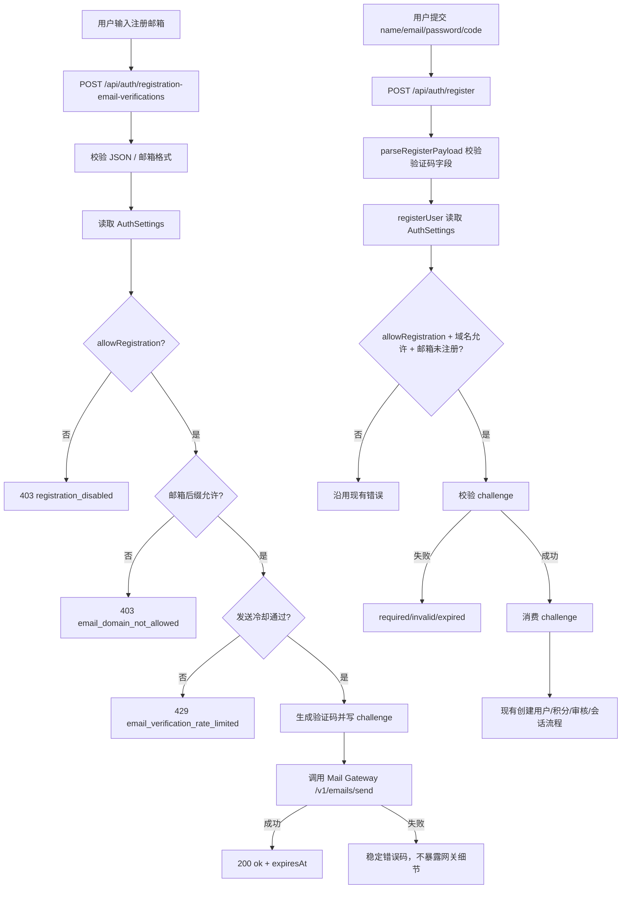

## 0. 术语约定

- 邮件网关：`cc-base Mail Gateway API`，由 `/Users/jesuscc/wcc/projects/wcc/cc-base/docs/mail-gateway-openapi.yaml` 描述；本应用作为内部调用方，向 `POST /v1/emails/send` 发送 `type=verification_code` 请求，并用 `X-Api-Key` 认证。防冲突结论：不把 Resend/Mailgun 等提供方接进本仓库，邮件服务商凭据留在网关。
- 注册邮箱验证码：发送到注册邮箱、用于证明邮箱可接收的一次性短码。防冲突结论：区别于现有“注册邮箱后缀支持列表”，后者只判断邮箱域名，前者验证邮箱归属。
- 验证挑战：服务端为某个规范化邮箱生成的验证码状态，包含验证码哈希、过期时间、发送节流和尝试次数。防冲突结论：不创建半成品用户；挑战通过后才进入现有 `users` 创建流程。
- 注册请求：现有 `POST /api/auth/register`。防冲突结论：保留原有注册入口，新增验证码字段，不新增第二个“创建用户”入口。

## 1. 决策与约束

### 需求摘要

为自助注册增加邮箱验证码。用户在注册页输入邮箱后先请求发送验证码；收到邮件后，把验证码随名称、邮箱、密码一起提交注册。注册必须验证同邮箱未过期验证码后才创建用户。

成功标准：

- 注册页能向当前邮箱发送验证码，并展示发送成功、冷却中和失败状态。
- `POST /api/auth/register` 缺少验证码、验证码错误、验证码过期时不创建用户、不写注册赠送积分、不设置会话。
- 验证码通过后，现有 `allowRegistration`、邮箱后缀支持列表、`requireApproval`、注册送积分和会话创建语义保持不变。
- 邮件网关错误映射为稳定本地错误码，不向前端暴露网关 API key、服务商错误细节或内部 URL。

明确不做：

- 不做登录二次验证、忘记密码、修改邮箱、邀请注册、邮件订阅或管理员代发邮件。
- 不在本仓库接入 Resend/Mailgun 等邮件服务商 SDK。
- 不新增后台 UI 管理邮件网关配置；本次用运行时环境变量配置网关地址和 API key。
- 不改变已有邮箱后缀支持列表、管理员审核、注册送积分规则。

假设：

- 网关调用配置使用 `MAIL_GATEWAY_BASE_URL`、`MAIL_GATEWAY_API_KEY`、`MAIL_GATEWAY_TIMEOUT_MS` 三个运行时变量；未配置时发送验证码返回不可用错误，自助注册无法完成。
- 验证码为 6 位数字，10 分钟过期；同一邮箱 60 秒内不能重复发送；单个验证码最多尝试 5 次。
- 验证码哈希使用 `MAIL_GATEWAY_API_KEY` 做 HMAC secret；如果后续需要独立轮换，可再拆出 `REGISTRATION_EMAIL_VERIFICATION_SECRET`。

### 复杂度档位

- 健壮性 = L3（偏离内部工具默认 L2 的原因：注册和邮件发送都是匿名外部输入入口，必须验证输入、节流、稳定错误码、失败不落脏数据）。
- 结构 = modules（偏离 functions 的原因：邮件网关调用、验证码状态和注册创建分别是独立职责，不能继续塞进已偏胖的 `auth-store.ts`）。
- 安全性 = validated（偏离 trusted 的原因：邮箱、验证码和网关响应都跨信任边界）。
- 可测试性 = tested（偏离 testable 的原因：注册门禁必须覆盖正常、错误、过期、重复发送和网关失败路径）。

### 关键决策

1. 新增“发送验证码”入口，注册入口只负责消费验证码。
   - 原因：发送邮件是副作用，用户需要在提交完整注册前先完成收信动作。
   - 另一种做法：`/api/auth/register` 发现没验证码时自动发送。名词层会把“创建用户”和“发验证码”混在同一个 endpoint，错误语义不清。

2. 验证挑战保存在数据库，而不是内存 Map。
   - 原因：项目支持 SQLite 和 MySQL，注册流程已经依赖持久化；进程重启或多实例时，内存状态会让用户拿到的验证码失效。
   - 另一种做法：内存缓存。名词层少一个表，但 Docker / MySQL 模式下可靠性差，不采用。

3. `POST /api/auth/register` 增加 `emailVerificationCode` 字段。
   - 原因：保留现有注册入口、响应和审核分支，验证码只是创建用户前的门禁。
   - 另一种做法：先调用 `/verify` 换取临时 token，再带 token 注册。名词层会多一个临时凭证，本次没有跨设备或长流程需求。

4. 邮件网关错误统一收敛为本地 auth 错误码。
   - 原因：OpenAPI 明确网关可能返回 provider、storage、rate limiter 等内部错误；前端只需要知道“验证码发送不可用/过于频繁/请求无效”。
   - 另一种做法：透传网关 `error.code`。会把外部服务契约泄漏为本应用公开 auth 契约，不采用。

### 前置依赖

- 运行环境需要可访问 cc-base Mail Gateway，并配置调用方使用的 `MAIL_GATEWAY_BASE_URL` 和 `MAIL_GATEWAY_API_KEY`。

## 2. 名词与编排

### 2.1 名词层

#### 现状

- `RegisterRequest` 只有 `name`、`email`、`password`，由 `parseRegisterPayload` 校验后传入 `registerUser`；来源：`packages/shared/src/auth.ts`、`apps/api/src/server/http/validation.ts`、`apps/api/src/domain/auth/auth-store.ts`。
- 注册路由只有 `POST /api/auth/register`、`POST /api/auth/login` 等账号入口；来源：`apps/api/src/server/routes/auth.ts`。
- 注册策略存在 `app_settings`，覆盖开放注册、审核、默认积分、邮箱后缀支持列表；来源：`apps/api/src/domain/auth/auth-store.ts`、`apps/api/src/infrastructure/schema.ts`。
- 持久化层当前没有验证码或邮件发送状态表；来源：`apps/api/src/infrastructure/schema.ts`、`sqlite-database.ts`、`mysql-database.ts`。
- 前端注册页只展示名称、邮箱、密码和邮箱域名提示；来源：`apps/web/src/App.tsx`。

#### 变化

- `RegisterRequest` 增加 `emailVerificationCode: string`，仅注册模式发送。
- 新增共享契约：
  - `RegisterEmailVerificationRequest`：`{ email: string; locale?: "zh-CN" | "en" }`
  - `RegisterEmailVerificationResponse`：`{ ok: true; expiresAt: string }`
  - `AuthErrorCode` 增加 `email_verification_required`、`email_verification_invalid`、`email_verification_expired`、`email_verification_rate_limited`、`email_verification_unavailable`。
- 新增持久化实体 `registration_email_verifications`：
  - `email`：规范化邮箱，主键或唯一键。
  - `code_hash`：验证码 HMAC 哈希，不保存明文。
  - `expires_at`：过期时间 ISO 字符串。
  - `verify_attempts`：当前验证码失败尝试次数。
  - `send_count`：当前窗口内发送次数。
  - `last_sent_at` / `created_at` / `updated_at`：节流和审计时间。
- 新增内部邮件网关客户端：
  - 输入：`{ to, code, locale, signal? }`
  - 输出：成功时返回网关 `request_id` 和可选 provider 摘要；失败抛领域错误，不返回网关原始细节。
- `AuthFormState` 增加 `emailVerificationCode`，注册页新增验证码输入与发送按钮。

#### 接口示例

```http
POST /api/auth/registration-email-verifications
{
  "email": "user@qq.com",
  "locale": "zh-CN"
}

200 {
  "ok": true,
  "expiresAt": "2026-05-28T10:20:00.000Z"
}
```

```http
POST /api/auth/register
{
  "name": "User",
  "email": "user@qq.com",
  "password": "password123",
  "emailVerificationCode": "123456"
}

201 {
  "user": {
    "id": "user-...",
    "email": "user@qq.com",
    "status": "active"
  }
}
```

```http
POST /api/auth/register
{
  "name": "User",
  "email": "user@qq.com",
  "password": "password123",
  "emailVerificationCode": "000000"
}

400 {
  "error": {
    "code": "email_verification_invalid",
    "message": "邮箱验证码无效。"
  }
}
```

```http
POST /v1/emails/send
X-Api-Key: <MAIL_GATEWAY_API_KEY>
{
  "type": "verification_code",
  "to": "user@qq.com",
  "code": "123456",
  "locale": "zh-CN"
}
```

### 2.2 编排层



#### 现状

注册主流程是线性分支：读取设置 → 检查开放注册 → 检查邮箱后缀 → 邮箱查重 → 密码哈希 → 写用户和注册赠送流水 → 按审核开关返回 pending 或会话。前端注册表单一次性提交完整账号信息。

#### 变化

- 注册页在邮箱字段旁新增“发送验证码”动作；成功后用户填写验证码，再提交完整注册表单。
- 新增发送验证码分支：校验邮箱 → 复用注册设置和邮箱后缀检查 → 检查发送节流 → 写挑战 → 调用邮件网关。
- 注册创建流程在邮箱查重之后、密码哈希和写用户之前插入“验证码校验 + 消费挑战”。
- 邮件网关调用只出现在发送验证码分支，不进入用户创建事务。

#### 流程级约束

- 错误语义：缺验证码返回 `email_verification_required`；验证码错误返回 `email_verification_invalid`；过期返回 `email_verification_expired`；发送节流返回 429 + `email_verification_rate_limited`；网关缺配置、超时、502/503/504 等失败返回 `email_verification_unavailable` 或上游语义折叠后的稳定码。
- 顺序约束：注册发送验证码和最终注册都先检查 `allowRegistration`、邮箱后缀；最终注册保留现有邮箱查重位置，验证码只在用户尚不存在时被消费。
- 数据一致性：验证码消费和用户创建需要在同一注册编排中顺序执行；若用户创建失败，验证码是否恢复不保证，用户可重新发送验证码。
- 网关失败回滚：发送验证码时先写入本次 challenge 以保证发送成功后可验证；若 Mail Gateway 调用失败，需要恢复原 challenge 或删除新 challenge，避免用户收到不可用错误后被无效冷却卡住。
- 幂等性：重复发送会替换同邮箱未消费挑战；重复提交同一已消费验证码不得创建第二个用户，最终由 `users(email)` 唯一约束兜底。
- 安全约束：验证码不进日志、不返回前端、不存明文；邮件网关 API key 不进入响应、文档示例或提交。
- 可观测点：服务端可记录网关 `request_id` 和本地错误码，但不记录验证码明文和完整 API key。

### 2.3 挂载点清单

- 公共 auth endpoint：`POST /api/auth/registration-email-verifications` — 新增发送注册验证码入口。
- 注册请求契约：`RegisterRequest.emailVerificationCode` 和 `AuthErrorCode` 验证码错误码 — 修改。
- 数据库 schema：`registration_email_verifications` 表及 SQLite/MySQL 初始化与迁移 — 新增。
- 注册策略入口：`registerUser` 创建用户前消费同邮箱验证码 — 修改。
- 外部系统调用：cc-base Mail Gateway `POST /v1/emails/send` + `X-Api-Key` — 新增。
- Web 注册表单：邮箱验证码发送按钮、验证码输入、发送状态和本地化错误文案 — 修改。

### 2.4 推进策略

1. 契约骨架：扩展 shared auth 类型和错误码，新增验证码发送请求/响应契约。
   - 退出信号：shared typecheck 通过，前后端能引用同一字段和错误码。
2. 持久化骨架：给 SQLite/MySQL 增加验证码挑战表和索引。
   - 退出信号：新库初始化和旧库启动迁移后都存在表，MySQL 注释/索引逻辑通过类型检查。
3. 后端计算节点：实现验证码生成、哈希、节流、校验、消费和邮件网关客户端。
   - 退出信号：不触达 UI 也能用 smoke 请求覆盖发送成功、缺配置、错误码、过期、尝试次数。
4. 后端编排接入：新增发送验证码路由，注册创建流程强制消费验证码。
   - 退出信号：无验证码无法注册；有效验证码后继续走 active / pending 原分支。
5. 前端交互接入：注册表单加入发送验证码、验证码输入、冷却/加载/成功/失败状态和 i18n 文案。
   - 退出信号：桌面和移动视口下表单不溢出，注册按钮只提交包含验证码的请求。
6. 验证覆盖：补 smoke 测试和文档同步。
   - 退出信号：新增注册验证码 smoke 覆盖关键路径，`pnpm typecheck`、`pnpm build` 通过。

### 2.5 结构健康度与微重构

##### 评估

- compound convention：未命中目录组织 / 命名 / 归属类 decision。
- 文件级 — `apps/api/src/domain/auth/auth-store.ts`：715 行，已承担设置读取、注册、登录、会话、管理员 bootstrap、旧数据归属回填；本次只应挂入验证码消费，不应继续把验证码生成和网关调用塞进去。
- 文件级 — `apps/api/src/server/http/validation.ts`：1239 行，已有所有 HTTP payload parser；本次会新增验证码请求 parser 和注册验证码字段校验，属于既有集中校验模式，但文件偏胖。
- 文件级 — `apps/api/src/infrastructure/sqlite-database.ts` / `mysql-database.ts`：524 / 738 行，已有 schema 初始化与迁移集中管理；新增表按现有模式加入，不单独拆迁移系统。
- 文件级 — `apps/web/src/App.tsx`：283 行，当前认证页逻辑集中在单组件；新增验证码交互会增加局部 state，但仍属于登录注册页内部。
- 文件级 — `apps/web/src/shared/i18n/index.tsx`：2176 行，项目现有所有文案集中管理；新增错误码和表单文案按现有规则追加。
- 目录级 — `apps/api/src/domain/auth`：现有 2 个文件，本次新增验证码领域文件不会造成目录摊平。
- 目录级 — `apps/api/src/domain`：已有多个领域目录，本次若新增 `mail` 或在 `auth` 下放网关客户端，只增加 1 个归属点，不触发目录重组。
- 目录级 — `apps/web/src`：不新增顶层文件；注册页仍在 `App.tsx`。

##### 结论：不做微重构

原因：本次可以通过新增 auth/mail 领域模块隔离主要复杂度，只在既有胖文件中做窄挂接；拆 `validation.ts`、`mysql-database.ts` 或 `i18n/index.tsx` 会超出“只搬不改行为”的安全范围，收益不抵验证码 feature 风险。

##### 超出范围的观察

- `apps/api/src/server/http/validation.ts` 和 `apps/web/src/shared/i18n/index.tsx` 已明显偏胖，后续如果多次扩展 auth/admin 表单，可单独走 `cs-refactor` 设计 parser/i18n 分组拆分。本 feature 不处理。

## 3. 验收契约

### 关键场景清单

- 输入支持域名邮箱并请求发送验证码 → 后端调用邮件网关 `verification_code`，返回 200 + `expiresAt`，响应不包含验证码明文。
- 邮件网关未配置或返回不可用 → 发送验证码接口返回稳定错误码，不暴露网关 API key、内部 URL 或 provider 原始错误。
- 同一邮箱在冷却时间内重复请求验证码 → 返回 429 + `email_verification_rate_limited`，不重复调用邮件网关。
- 注册请求缺少 `emailVerificationCode` → 返回 `email_verification_required`，数据库不新增用户和积分流水。
- 注册请求验证码错误或尝试次数超限 → 返回 `email_verification_invalid`，数据库不新增用户和积分流水。
- 注册请求验证码过期 → 返回 `email_verification_expired`，数据库不新增用户和积分流水。
- 注册请求使用正确邮箱和未过期验证码 → 创建用户，`requireApproval=false` 时返回 201 + session，`requireApproval=true` 时返回 202 pending；注册送积分流水保持事务一致。
- 验证码属于邮箱 A，但注册提交邮箱 B → 返回验证码无效或必需错误，不创建邮箱 B 用户。
- 邮箱域名不支持或注册关闭 → 发送验证码和最终注册都沿用 `email_domain_not_allowed` / `registration_disabled`，不发送邮件。
- 前端桌面和移动视口注册页 → 邮箱、验证码按钮、验证码输入、密码和提交按钮不重叠，加载/成功/错误状态可被读屏感知。

### 明确不做的反向核对项

- 代码中不应出现 Resend/Mailgun SDK 或服务商 API key 环境变量读取。
- 登录、退出、Codex OAuth、管理员 bootstrap 不应要求 `emailVerificationCode`。
- 后台管理系统设置页不应出现邮件网关配置表单。
- 现有邮箱后缀支持列表、管理员审核和注册送积分字段语义不应改变。

## 4. 与项目级架构文档的关系

- `ARCHITECTURE.md` 需要更新本地账号术语：增加“注册邮箱验证码 / 验证挑战 / 邮件网关”。
- 认证域服务索引需要补充：注册创建前会消费验证码挑战；验证码发送和校验是认证域服务的一部分。
- 持久化层索引需要补充：SQLite/MySQL 新增 `registration_email_verifications` 保存验证码挑战状态。
- Web 注册入口索引需要补充：注册页从一次提交变成“发送验证码 → 填码注册”。
- 已知约束需要调整：旧约束写明“不支持邮箱验证码”，本 feature 验收通过后应删除或改写为“只做注册验证码，不做登录 MFA / 找回密码”。
