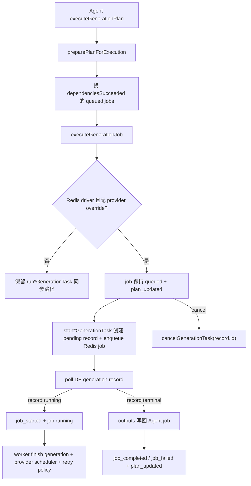

## 0. 术语约定

- Agent generation scheduler adapter：Agent executor 与 generation queue / provider scheduler 之间的适配层。防冲突结论：不是 Agent planner，也不是 provider 选择器。
- Agent plan job：`GenerationPlan.jobs[]` 中的任务节点，状态为 queued / running / succeeded / partial / failed / blocked / cancelled。
- scheduled Agent generation：Agent job 触发的一次 DB generation record。Redis 模式下它先是 pending record + queue job，worker 执行后变 running / terminal。
- provider override path：smoke 或测试显式传入 fake `ImageProvider` 的执行路径。防冲突结论：这是测试替身，不是生产 provider 路由。
- `retry_failed`：用户触发的 Agent 计划重跑失败 job 行为，不等于 provider retry policy。

## 1. 决策与约束

### 需求摘要

当前 Agent executor 在 `executeGenerationJob()` 内直接调用 `runTextToImageGenerationTask` / `runReferenceImageGenerationTask`，即使 `GENERATION_QUEUE_DRIVER=redis` 也不会把 Agent generation job 入队。provider call 已经受全局闸门和 retry policy 保护，但 Agent job 仍绕过 generation queue 的 pending / worker 协议。本 feature 将 Agent production 路径接入同一队列：依赖满足后 Agent job 创建 pending generation record、写 Redis job、等待 DB record 终态，再把 outputs 回写到 plan job。

成功标准：

- `GENERATION_QUEUE_DRIVER=redis` 且没有显式 fake provider 时，Agent text/edit job 通过 `startTextToImageGenerationTask` / `startReferenceImageGenerationTask` 入队。
- Agent job 入队等待期间在 plan 中保持 `queued`；worker 把 generation record 推到 `running` 后 Agent job 变 `running` 并发送 `job_started`。
- Agent executor 仍按 DAG 依赖顺序执行；`retry_failed` 只重跑失败/阻塞/取消 job，不重跑已成功上游 job。
- Agent 取消时会取消对应 generation record，pending job 从 Redis ready list 移除，running job 尽力 abort。
- provider override path 和 `GENERATION_QUEUE_DRIVER=inline` 保留现有同步执行语义，保证 smoke 测试能用 fake provider 覆盖业务规则。

明确不做：

- 不实现 per-output Redis job、`generation:queue:delayed`、`generation:attempt:*`、重启后恢复 Agent run 或跨进程恢复 WebSocket session。
- 不新增 Agent retrying 状态、前端 retrying UI、admin queue monitor 或队列位次展示；provider retry 可观测性留给 `generation-queue-observability`。
- 不改变 Agent planner schema、DAG 验证规则、总图数上限或每 job 引用上限。
- 不改变积分价格、退款规则、provider source order 或生成记录表结构。
- 不让 Redis job 保存 prompt、reference image bytes、provider credential、audit payload、credit transaction 或完整 generation record。

### 复杂度档位

- 健壮性 = L3：入队后必须可取消，等待终态不能吞掉失败/partial/cancelled。
- 结构 = modules：新增 Agent adapter 文件，避免继续膨胀 `executor.ts`。
- 安全性 = validated：Agent queue path 复用 generation queue 安全边界，Redis 只保存路由元数据。
- 可测试性 = tested：新增 Agent queue smoke 覆盖入队、queued/running 状态、取消清理和 prompt 不进 Redis。
- Concurrency = distributed-aware：真实 provider API 并发只由 provider scheduler 控制；Agent job fan-out 不再直接启动 provider call。

### 关键决策

1. Redis production 路径使用已有 generation 级 queue，不新建 Agent 专用 queue。
   - 原因：手动生成已通过 `generation:queue:ready` 和 `generation:job:{generationId}` 承载同类 DB generation record；Agent 生成本质也是 generation record。
   - 另一种做法：新增 `agent:queue:*`。会复制 worker、取消和失败收敛逻辑，偏离“同一队列”目标。

2. Agent executor 等待 DB generation record 终态，而不是等待 Redis job。
   - 原因：DB 是生成事实来源；Redis 是短期运行态。终态、outputs、退款和 audit 都在 DB 收敛。
   - 另一种做法：从 Redis job 或事件通道取结果。现有 queue 没有 result channel，会引入额外运行态协议。

3. provider override path 不进 Redis queue。
   - 原因：当前 worker 总是通过真实 `createConfiguredImageProvider()` 重建 provider，无法安全携带 fake provider 到 Redis job；smoke 需要 provider 注入验证业务规则。
   - 另一种做法：给 queue worker 加全局测试 provider override。会把测试替身混进生产 worker 生命周期，不采用。

## 2. 名词与编排

### 2.1 名词层

#### 现状

- `apps/api/src/domain/agent/executor.ts` 在执行前创建或接收一个 `ImageProvider`，然后每个 job 直接调用 `runTextToImageGenerationTask` / `runReferenceImageGenerationTask`。
- `run*GenerationTask` 总是创建 running record 并同步等待 `finish*Generation` 完成；不会走 Redis queue。
- `start*GenerationTask` 已能在 Redis driver 下创建 pending record 并入队；inline driver 下保留 background task。
- Agent UI 已能显示 job 的 `queued` 和 `running` 状态；WebSocket 已有 `plan_updated`、`job_started`、`job_completed`、`job_failed`、`job_blocked` 事件。

#### 变化

新增 adapter 输入：

```ts
interface ScheduledAgentGenerationInput {
  runId: string;
  jobId: string;
  user: CurrentUser;
  provider?: ImageProvider;
  signal: AbortSignal;
  isRunActive: () => boolean;
  onRunning?: (record: GenerationRecord) => void;
}
```

新增 adapter API：

```ts
function shouldUseAgentGenerationQueue(provider?: ImageProvider): boolean;
async function runScheduledAgentTextGeneration(input: ScheduledAgentGenerationInput & { request: ImageProviderInput }): Promise<GenerationRecord>;
async function runScheduledAgentReferenceGeneration(input: ScheduledAgentGenerationInput & { request: EditImageProviderInput }): Promise<GenerationRecord>;
```

### 2.2 编排层



#### 现状

Agent executor 的 job 并发由 `AGENT_JOB_CONCURRENCY=2` 控制。每个 job 内部直接进入 generation task，同步拿到 record 后立即把 outputs 填回 plan job。取消只通过 Agent run 的 AbortSignal 传给同步 generation task。

#### 变化

- `executeGenerationPlan` 在 Redis + 无 provider override 时不提前创建 provider；worker 会在消费 generation queue job 时创建真实 provider。
- `executeGenerationJob` 根据 adapter 判断执行分支：queue path 先保持 job queued，direct path 保持现有 job running。
- queue path 调用 `startTextToImageGenerationTask` / `startReferenceImageGenerationTask`，随后轮询 `readGenerationTaskRecord` 直到 terminal。
- 轮询期间第一次观察到 record running 或 terminal 时，Agent job 切到 running 并发送 `job_started`。
- AbortSignal 取消或 run 不再 active 时，adapter 调用 `cancelGenerationTask` 取消 pending/running generation record。
- terminal record 的 outputs、partial/failed 语义继续由现有 `jobStatusFromOutputs` 转换。

#### 流程级约束

- DAG 语义：只有 dependenciesSucceeded 的 job 会入队；下游仍等待上游 succeeded/partial。
- 并发语义：`AGENT_JOB_CONCURRENCY` 只限制当前 Agent run 同时提交/等待的 job 数，不是 provider API 并发限制；provider API 并发仍只由 `GENERATION_PROVIDER_GLOBAL_CONCURRENCY` 控制。
- 错误语义：入队失败、终态 failed、终态 cancelled 都回到现有 `job_failed` / plan status 收敛。
- 取消语义：Agent run abort 后必须取消已创建的 generation record；pending job 要从 Redis ready list 移除。
- 安全边界：Agent adapter 不向 Redis 写 prompt/reference bytes/provider credential，只通过已有 `start*GenerationTask` 写 generation queue job。

### 2.3 挂载点清单

- Agent adapter 模块：新增 `apps/api/src/domain/agent/generation-scheduler-adapter.ts`。
- Agent executor：`apps/api/src/domain/agent/executor.ts` 使用 adapter 选择 queue path 或 direct provider override path。
- Agent smoke：扩展 `apps/api/src/smoke/agent-executor-smoke.ts`，新增 Redis queue enqueue/cancel 场景。
- 文档：`docs/RELIABILITY.md` 记录 Agent Redis queue path；`docs/SECURITY.md` 补 Agent queue payload 边界。
- 架构 / roadmap：acceptance 回写 `.codestable/architecture/ARCHITECTURE.md` 和 roadmap item 状态。

### 2.4 推进策略

1. 名词契约：新增 Agent generation scheduler adapter 和 queue/direct 分支判定。
   - 退出信号：adapter 能在 Redis/no provider override 时调用 start*，inline/provider override 时调用 run*。
2. Executor 接入：Agent job queued/running 状态和事件按 queue/direct 分支收敛。
   - 退出信号：direct path smoke 仍保持原有成功、partial、blocked、retry_failed 行为。
3. 取消与等待：queue path 等待 DB terminal，并在 abort 时取消 generation record / Redis job。
   - 退出信号：Redis smoke 能观察 queued job payload、取消后 job key 和 ready list 清理。
4. 文档与架构：更新可靠性/安全文档和 CodeStable 架构边界。
   - 退出信号：Agent queue path、provider override path 和 Redis payload 边界被记录。
5. 验证：运行 typecheck/build、agent executor smoke、generation queue smoke、provider scheduler/retry/planner smoke。
   - 退出信号：关键 smoke 通过，Redis ready list/provider permit 无残留。

### 2.5 结构健康度与微重构

##### 评估

- compound convention：未命中 Agent adapter 命名 / 目录组织类 decision；已有 concurrency 探索确认 Agent executor 当前有独立 job 并发。
- 文件级 — `apps/api/src/domain/agent/executor.ts`：约 859 行，职责偏多；本次只替换执行分支，queue 等待/取消逻辑放新 adapter 文件。
- 文件级 — `apps/api/src/domain/generation/generation-tasks.ts`：约 399 行，已有 manual queue worker 与 direct run API；本次复用公开 API，不继续加 Agent 特化逻辑。
- 目录级 — `apps/api/src/domain/agent`：已有 planner/executor/websocket/config/store 等同域文件，新增 adapter 属于 Agent 执行域，不触发目录重组。

##### 结论：不做微重构

原因：新增 adapter 文件能隔离 queue 等待和取消逻辑；拆 `executor.ts` 或重组 `domain/agent` 会超出本 feature 的行为变更范围。后续如果 Agent runtime 继续增长，可单独走 `cs-refactor` 拆 executor。

## 3. 验收契约

### 关键场景清单

1. `GENERATION_QUEUE_DRIVER=redis` 且未传 provider override -> Agent job 创建 pending generation record 和 Redis job，Redis job payload 不包含 prompt。
2. queued generation record 被 worker 标记 running -> Agent job 从 queued 变 running，并发送 `job_started`。
3. terminal succeeded/partial/failed record -> Agent job outputs/status/error 与现有 direct path 规则一致。
4. Agent run 在 pending queue 阶段取消 -> generation record 变 cancelled，Redis job key 和 ready list 被清理。
5. `retry_failed` -> 保留成功上游 job，只重跑失败 job；Redis queue path 不改变 DAG 依赖规则。
6. `GENERATION_QUEUE_DRIVER=inline` 或显式传入 fake provider -> 保留 direct path，现有 Agent executor smoke 通过。
7. 所有 provider call 仍经 `runProviderCallWithRetry` / provider scheduler；Agent adapter 不新增 provider 调用通道。

### 明确不做的反向核对项

- 不新增 Agent 专用 Redis queue key。
- 不新增 per-output Redis job、delayed queue 或重启恢复 Agent run。
- 不新增 Agent retrying 状态、前端 retrying UI 或 admin queue monitor。
- 不改 Agent planner schema、DAG 验证、总图数上限或引用上限。
- 不把 prompt、reference image bytes、provider credential、audit payload、credit transaction 或完整 generation record 写入 Redis。

## 4. 与项目级架构文档的关系

acceptance 阶段应把以下内容提炼回 architecture：

- Agent production generation path 在 Redis driver 下进入 generation queue，并等待 DB generation record 终态回写 plan job。
- provider override / inline path 是测试和本地调试替身，不提供 Redis queue 语义。
- Agent job queued/running 是 plan 层状态；generation record pending/running 是 DB 层状态，两者通过 adapter 映射。
- 当前仍未实现 Agent run 重启恢复、per-output queue、delayed retry queue 和 retry/queue 可观测性。
