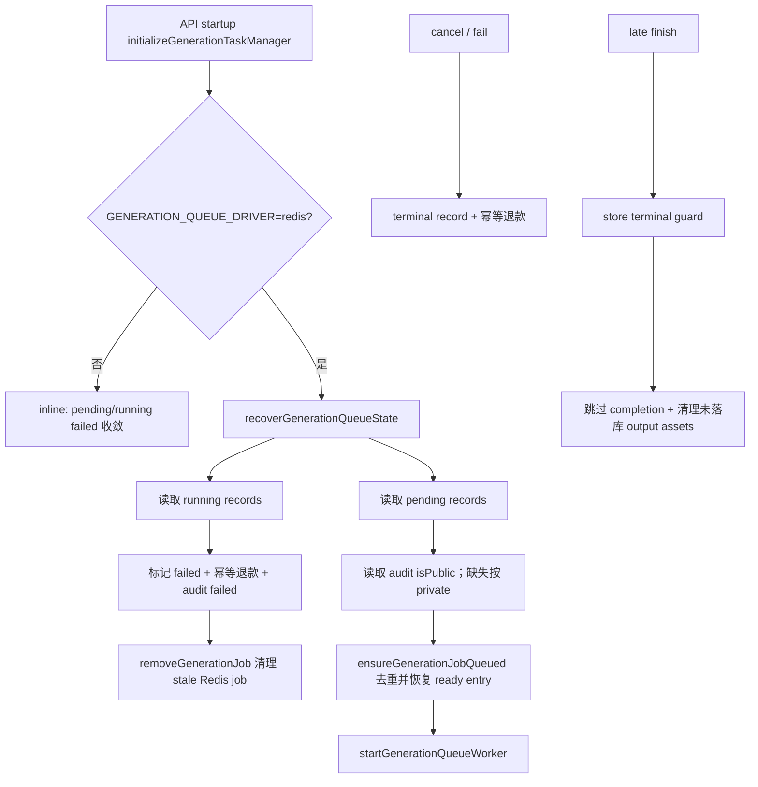

## 0. 术语约定

- Generation state bridge：连接 DB generation record、Redis queue job、audit 和 credit transaction 的一致性边界。防冲突结论：不是新的队列，也不是 provider retry policy。
- recoverable pending generation：DB 中 `status="pending"` 的 generation record。Redis job / ready list 丢失时可从 DB + audit 重建 queue job。
- interrupted running generation：API 启动时仍处于 `status="running"` 的 generation record。上一进程可能已丢失 active AbortController，必须失败收敛并退款。
- terminal completion guard：`succeeded` / `partial` / `failed` / `cancelled` record 不允许被晚到的 finish 流程覆盖。
- durable visibility：recovery 重建 Redis job 时需要的 `isPublic`。当前持久来源是 `generation_audits.is_public`；缺失时按 private 恢复。

## 1. 决策与约束

### 需求摘要

`generation-queue-worker` 已让 Redis 模式下手动生成和 Agent 生成先创建 pending record，再写 `generation:job:{generationId}` 和 `generation:queue:ready`。当前缺口是：Redis ready list 或 job key 丢失后 pending record 不会自动恢复；worker `LPOP` 后进程崩溃会留下 job key 但 ready list 不再包含它；running record 启动失败收敛后可能留下 stale Redis job；取消和失败虽然已退款幂等，但 late finish 仍需要在持久化层挡住终态覆盖。

成功标准：

- Redis driver 启动恢复时，`running` generation 被标记为 failed，audit 更新为 failed，积分按 generation id 幂等退款，相关 Redis job key / ready entry 被清理。
- Redis driver 启动恢复时，`pending` generation 保持 pending，并确保 Redis job key 和 ready list 中存在且只有一条可消费 job。
- pending job 恢复时不把 prompt、reference bytes、provider credential、audit payload、credit transaction 或完整 generation record 写入 Redis。
- pending job 的 `isPublic` 从 durable audit 读取；audit 缺失时安全回退为 private。
- late finish 不能把已 cancelled / failed 的 generation 覆盖为 succeeded / partial，也不能落下未引用的成功 output 资产。
- 退款仍按 generation id 幂等：取消、失败、启动 interrupted 收敛和重复恢复不会写多条 refund。

明确不做：

- 不做 per-output Redis job、`generation:queue:delayed`、`generation:attempt:*` 或 provider retry 的跨重启续跑。
- 不恢复已经 running 的 provider call；上一进程丢失后统一按 interrupted failed 处理，用户从历史重跑。
- 不新增前端 queue UI、admin queue monitor、队列位次、retrying 状态或 WebSocket 恢复。
- 不改积分定价、最大图片数、输出表结构、provider source order 或 Agent planner schema。
- 不让 Redis 保存 prompt、reference image bytes、provider credential、audit payload、credit transaction 或完整 generation record。

### 复杂度档位

- 健壮性 = L3：恢复、取消、失败和 late completion 都必须可重复执行且不破坏事实状态。
- 结构 = modules：新增 state bridge 模块承接跨 DB / Redis / audit / credits 的 orchestration，避免继续膨胀 queue worker。
- 安全性 = validated：Redis 仍只保存路由元数据，public visibility 来自 audit 且缺失时回退 private。
- 可测试性 = tested：新增 recovery smoke 覆盖 pending requeue、running interrupted、退款幂等和 terminal guard。
- Concurrency = startup-bounded：恢复在 worker 启动前执行；不做运行时分布式 repair loop。

### 关键决策

1. pending recovery 只重建 generation 级 queue job，不引入 per-output queue。
   - 原因：当前完成、审计和退款事实都以 generation record 收敛；per-output job 需要新的 output 幂等协议，超出本 item。

2. pending job 的 `isPublic` 从 audit 读取，缺失时按 private 恢复。
   - 原因：`generation_records` 当前不保存 public flag；audit start 在入队前写入，是已有 durable 来源。缺失时 private 是安全默认值。

3. running recovery 失败收敛，不尝试恢复 provider call。
   - 原因：进程重启后 active AbortController 和 provider call 已丢失，无法证明上游状态；DB 必须给用户可理解终态。

4. terminal completion guard 放在持久化事务内。
   - 原因：`image-generation.ts` 已有 finish 前读终态短路，但取消 / fail 可与 output 保存并发；最终事实守卫必须靠 store transaction 决定。

## 2. 名词与编排

### 2.1 名词层

#### 现状

- `apps/api/src/domain/generation/generation-queue.ts` 有 `enqueueGenerationJob()` 和 `removeGenerationJob()`，但没有“确保 job key + ready list 存在且去重”的恢复 API。
- `apps/api/src/domain/generation/generation-tasks.ts` 的 `initializeGenerationTaskManager()` 在 Redis driver 下只失败收敛 `running` record，然后启动 worker；不会恢复 `pending` record 对应的 Redis job。
- `apps/api/src/domain/generation/image-generation.ts` 的 `markInterruptedGenerationRecordsFailed()` 会退款并更新 audit，但不返回被收敛的 generation id，因此调用方不能清理对应 Redis job。
- `apps/api/src/domain/storage/store.ts` 的 `completeGenerationRecordWithOutputs()` 会在事务里删除旧 outputs 并更新 record；它没有在同一事务中拦截已 terminal 的 record。

#### 变化

新增 state bridge 输入 / 输出：

```ts
interface RecoverableGenerationQueueRecord {
  id: string;
  userId?: string;
  mode: "generate" | "edit";
  status: "pending" | "running";
}

async function recoverGenerationQueueState(): Promise<{
  recoveredPending: number;
  failedRunning: number;
}>;
```

新增 / 调整能力：

- Queue 模块新增 idempotent `ensureGenerationJobQueued(job)`：写 job key 前先移除 ready list 中同 key 的旧条目，再推入一条 ready entry。
- Store 模块新增按状态列出 recovery record 的查询能力；仅返回恢复所需的路由字段，不返回 prompt。
- Audit 模块新增读取 generation public visibility 的能力；缺行返回 `undefined`。
- `markInterruptedGenerationRecordsFailed()` 返回本次启动前命中的 interrupted generation id，供 bridge 清理 Redis stale job。
- `completeGenerationRecordWithOutputs()` 返回是否真的完成写入；如果发现 record 已 terminal，返回 skipped，由上层清理本次未落库资产。

### 2.2 编排层



#### 现状

Redis worker 使用 polling `LPOP`。job 被 pop 后，如果进程崩溃，ready list entry 已消失；如果崩溃发生在 worker 标记 running 后，下次启动会把 record 标记 failed，但不会清理 job key。若 Redis key 被人工清理或实例重启导致 ready list 丢失，DB pending record 会一直 pending。

#### 变化

- Redis driver 启动时先执行 `recoverGenerationQueueState()`，再启动 worker。
- `recoverGenerationQueueState()` 先处理 running：按现有 interrupted failed 语义更新 DB / audit / credits，并清理这些 generation 的 Redis job。
- 然后处理 pending：从 DB 列出 pending record，从 audit 读取 `isPublic`，调用 `ensureGenerationJobQueued()` 重建 / 去重 Redis job。
- queue worker 消费 pending job 时仍走现有 `markGenerationRecordRunning()` 和 `finish*Generation()`。
- cancel / fail 的退款继续使用 `refundGenerationCreditsForFailures()` 的 generation id 幂等逻辑。
- late finish 完成前如果 record 已 terminal，store 不删除 outputs、不二次退款、不改 status；上层清理这次新生成但未引用的 asset bytes。

#### 流程级约束

- 顺序语义：startup recovery 必须在 `startGenerationQueueWorker()` 前执行，避免 worker 和 repair 同时操作 ready list。
- 幂等语义：重复执行 recovery 不增加 ready list 重复项，不重复退款，不重复审计开始记录。
- 安全语义：recovery Redis payload 仍只含 generation id、user id、mode、visibility、attempt 和 enqueue time。
- 错误语义：pending recovery 中单条 job 恢复失败应让启动失败，而不是静默进入有 pending record 但无 worker job 的状态。
- 兼容语义：inline driver 保持现有“启动时 pending/running 都 interrupted failed”的本地调试行为。

### 2.3 挂载点清单

- State bridge 模块：新增 generation queue recovery orchestration。
- Generation queue 模块：新增 idempotent ensure API，复用现有 Redis key 协议。
- Store / audit 查询边界：新增只读 recovery 查询和 visibility 查询。
- Completion 持久化边界：store completion 事务加 terminal guard，上层清理 skipped completion 的临时成功 assets。
- Smoke：新增 recovery smoke，覆盖启动恢复和 terminal guard。
- Docs / CodeStable：可靠性、安全、架构和 roadmap 回写恢复边界。

### 2.4 推进策略

1. 名词契约：新增 recovery record、audit visibility、idempotent queue ensure API。
   - 退出信号：能从 DB/audit 重建不含敏感字段的 queue job，并去重 ready entry。
2. Startup recovery：Redis driver 启动先 failed 收敛 running，再 requeue pending，最后启动 worker。
   - 退出信号：smoke 能模拟 Redis job 丢失后恢复 pending ready entry，并模拟 running interrupted 后退款一次。
3. Terminal guard：completion transaction 阻止 late finish 覆盖 terminal record，并清理未落库 assets。
   - 退出信号：smoke 能取消 running record 后再执行 finish，最终仍是 cancelled、outputs 为空、refund 只有一条。
4. 文档与架构：更新可靠性/安全文档和 CodeStable 架构边界。
   - 退出信号：pending recovery、running interrupted、visibility fallback 和不做 per-output recovery 被记录。
5. 验证：运行 typecheck/build、recovery smoke、queue/agent queue/provider retry/provider scheduler/executor/planner smoke。
   - 退出信号：关键 smoke 通过，Redis ready list/provider permit 无残留。

### 2.5 结构健康度与微重构

##### 评估

- compound convention：未命中 generation state bridge 命名 / 目录组织类 decision；已有 generation queue worker 设计建议后续 state bridge 复用 queue module、不另开 Redis queue key。
- 文件级 — `apps/api/src/domain/generation/generation-tasks.ts`：已承担 start/cancel/worker 编排；本次只挂 startup bridge 调用，不把 recovery 细节继续塞进去。
- 文件级 — `apps/api/src/domain/generation/generation-queue.ts`：职责是 Redis queue key 协议和 worker loop；新增 idempotent ensure API 属于同一职责。
- 文件级 — `apps/api/src/domain/generation/image-generation.ts`：约千行，职责偏大；本次只调整状态桥入口和 completion skipped cleanup，不做大拆。
- 文件级 — `apps/api/src/domain/storage/store.ts`：已承担 generation record 事务；terminal guard 必须落在这里才有并发意义。
- 目录级 — `apps/api/src/domain/generation`：已有 scheduler/queue/retry/agent adapter，新增 `generation-state-bridge.ts` 属于同域调度一致性能力，不需要目录重组。

##### 结论：不做微重构

原因：新增 state bridge 文件足以隔离跨模块 recovery orchestration；拆 `image-generation.ts` / `store.ts` 会变成行为不变大重构，超出本 feature。后续如果 per-output state bridge 落地，再单独走 `cs-refactor` 评估 output runner / record store 拆分。

## 3. 验收契约

### 关键场景清单

1. Redis driver 下 DB 有 pending record，但 `generation:job:{id}` 和 ready list 丢失 -> recovery 重建 job key 和单条 ready entry，record 仍是 pending。
2. Redis driver 下 DB 有 pending record，job key 和 ready list 已存在多份 -> recovery 后 ready list 中该 job key 只有一份。
3. pending recovery 的 Redis payload 不包含 prompt、reference bytes、provider credential、audit payload、credit transaction 或完整 generation record。
4. pending recovery 从 audit 恢复 public visibility；audit 缺失时恢复为 private。
5. Redis driver 下 DB 有 running record -> startup recovery 标记 failed、audit failed、退款一次，并清理 Redis job key / ready entry。
6. 重复执行 running recovery -> 不重复写 refund transaction，不增加用户积分。
7. 用户取消 pending/running generation -> record cancelled、Redis job 清理、退款一次；再次 cancel 不重复退款。
8. cancelled / failed generation 遇到 late finish -> status 不被覆盖，outputs 不落库，未引用成功 asset 被清理。
9. inline driver 启动仍按原语义把 pending/running failed 收敛。

### 明确不做的反向核对项

- 不新增 `generation:queue:delayed`、`generation:attempt:*`、per-output Redis job 或 processing list。
- 不恢复 running provider call，不做跨重启 retry sleep 续跑。
- 不新增前端 queue UI、admin monitor、排队位次或 retrying 状态。
- 不改积分定价、最大图片数、输出表结构、provider source order 或 Agent planner schema。
- 不把 prompt、reference image bytes、provider credential、audit payload、credit transaction 或完整 generation record 写进 Redis。

## 4. 与项目级架构文档的关系

acceptance 阶段应把以下内容提炼回 architecture：

- Redis driver 启动时先执行 generation state bridge，再启动 queue worker。
- pending recovery 使用 DB generation record + audit visibility 重建 generation 级 queue job。
- running interrupted 统一 failed 收敛并清理 stale Redis job；不恢复 provider call。
- completion terminal guard 是 DB 事实边界，防止 late finish 覆盖 cancelled / failed。
- 当前仍未实现 per-output queue、delayed retry、processing list、队列可观测性和前端排队状态。
