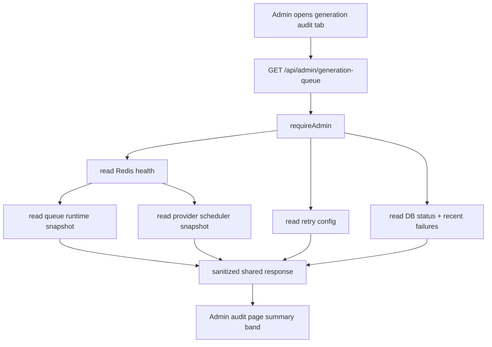

# Generation Queue Observability Design

## 0. 术语约定

- **queue observability**：后台管理员可读的生成调度状态快照。防冲突结论：不是公开监控大盘，也不是用户侧排队位次。
- **runtime snapshot**：一次读取 Redis / 进程内 worker / provider scheduler 配置后形成的短期状态。
- **database summary**：从 DB generation record / output / audit 读取的事实状态聚合，用来解释 pending、running、failed 和 recent failure。
- **retry summary**：当前 retry policy 配置和最终失败摘要。防冲突结论：不是 per-output delayed queue，也不是跨重启 retry attempt 持久化。

## 1. 决策与约束

### 需求摘要

`generation-provider-scheduler` 已完成 Redis runtime、全局 provider 闸门、Redis queue worker、retry policy、Agent adapter 和 startup recovery。现在管理员需要在后台看到当前排队、运行、provider 闸门、retry 策略和失败摘要，避免高并发问题只靠 Redis CLI 或日志定位。

### 成功标准

- 管理员打开后台生成审计页时，可以看到 Redis driver 状态、ready queue 长度、worker 运行状态、provider active permits / configured concurrency、retry 配置、DB pending/running/failed/partial 计数和最近失败摘要。
- 后台 API 只对 admin 开放，不暴露 `REDIS_URL`、Redis host、密码、raw Redis error、provider secret 或完整 Redis payload。
- Redis 不可用或 `GENERATION_QUEUE_DRIVER=inline` 时，接口仍返回可解释状态，不让前端崩溃。

### 明确不做

- 不新增公开监控大盘、Prometheus 指标、WebSocket live monitor 或告警。
- 不新增 `generation:queue:delayed`、`generation:attempt:*`、per-output Redis job、processing list 或 retry attempt 持久化。
- 不展示用户侧排队位次或预计完成时间。
- 不改变 provider 并发、worker 并发、retry 配置解析或生成状态机。
- 不把 prompt、reference bytes、provider credential、audit payload、credit transaction、Redis URL 或 raw upstream error 写进新的 Redis key / API 响应。

### 复杂度档位

- 结构 = modules：新增小型 observability 模块聚合 queue / provider / retry / DB 状态，不把这些读取逻辑塞进 route 或 queue worker。
- 可用性 = best-effort：观测接口尽力读取 Redis；Redis 不可用时返回 `redis.status="unavailable"` 和 DB summary。
- 安全性 = admin-only + sanitized：复用 `/api/admin/*` 的 admin session 边界，只返回数字、枚举和稳定失败摘要。
- 前端 = dense admin surface：复用现有后台生成审计页顶部的摘要带，不新增独立营销式页面。

## 2. 名词与编排

### 2.1 名词层

**现状**

- `packages/shared/src/admin.ts` 只有 `AdminGenerationAuditsResponse`，没有队列 runtime 状态契约。
- `apps/api/src/domain/generation/generation-queue.ts` 持有 ready list key、worker config 和 worker lifecycle，但没有公开读取 ready length / worker running / active worker 的 API。
- `apps/api/src/domain/generation/provider-scheduler.ts` 持有 provider permit key、inline active permit 和配置，但没有公开 active permits 快照。
- `apps/api/src/domain/generation/provider-retry-policy.ts` 只有配置读取和 retry 决策，没有 admin 可读摘要。
- `apps/api/src/domain/admin/admin-store.ts` 可列生成审计，但没有 pending/running/failed 聚合。

**变化**

新增共享响应契约：

```ts
interface AdminGenerationQueueStatusResponse {
  updatedAt: string;
  redis: { status: "ok" | "disabled" | "unavailable" };
  queue: {
    driver: "redis" | "inline";
    readyLength?: number;
    workerRunning: boolean;
    activeWorkers: number;
    workerConcurrency: number;
    pollIntervalMs: number;
  };
  provider: {
    configuredConcurrency: number;
    activePermits?: number;
    availablePermits?: number;
    permitTtlMs: number;
  };
  retry: {
    maxRetries: number;
    maxAttempts: number;
    baseDelayMs: number;
    maxDelayMs: number;
  };
  database: {
    records: Record<GenerationStatus, number>;
    outputs: { succeeded: number; failed: number };
    recentFailures: Array<{
      generationId: string;
      status: "failed" | "partial" | "cancelled";
      errorSummary?: string;
      updatedAt: string;
    }>;
  };
}
```

示例：Redis 正常且有 3 条 ready job、1 个 provider call 在跑时，admin API 返回 `queue.readyLength=3`、`provider.activePermits=1`、`provider.availablePermits=configuredConcurrency - 1`。

### 2.2 编排层



**现状**

- Admin page 在 `audits` tab 加载 `/api/admin/generation-requests?limit=200`，只展示审计列表。
- Admin route 已有 `requireAdmin` 和稳定 admin error shape。
- Redis health 只在 `/api/health` 暴露 `ok|disabled|unavailable`。

**变化**

- 新增 `GET /api/admin/generation-queue`，复用 `requireAdmin`。
- API orchestration 并行读取 queue snapshot、provider snapshot、retry config 和 DB summary。Redis 状态不可用时，Redis runtime 数字字段留空，DB summary 仍返回。
- 前端在 `audits` tab 同时加载 queue status 和 generation audits；顶部显示紧凑指标，再显示现有审计列表。
- 点击现有“刷新”会同时刷新 audits 和 queue status。

流程级约束：

- 错误语义：admin 未登录 / 非 admin 仍走现有 401/403；Redis 指标读取失败不暴露 raw error。
- 幂等性：所有读取 API 不写 DB；provider snapshot 允许清理过期 permit 计数，等价于 existing acquire 前清理。
- 并发：不新增 worker 或 provider 调用；观测读取不能绕过 provider 闸门。
- 安全：响应只含枚举、数字、generation id、稳定错误摘要和时间戳。

### 2.3 挂载点

- Shared admin contract：删掉后前后端无法共享 queue status 响应形状。
- API admin route：删掉后后台无法读取观测数据。
- Generation observability domain：删掉后 route 失去 queue/provider/retry/DB 聚合逻辑。
- Web admin audits tab：删掉后用户看不到队列和 provider 闸门状态。
- Admin i18n / CSS：删掉后观测 UI 文案和布局消失。

### 2.4 推进策略

1. 名词契约：新增 shared admin queue status 类型，API 能返回可验证 shape。
   - 退出信号：typecheck 能看到前后端共用类型，前端 guard 覆盖新增字段。
2. Runtime snapshot：queue / provider scheduler 暴露安全快照，observability 模块聚合 Redis health、retry config 和 DB summary。
   - 退出信号：smoke 能在 Redis 模式下读到 ready length / active permits，在 inline 模式下不连接 Redis。
3. Admin API：新增 admin-only route，并用 smoke 覆盖鉴权边界和响应字段。
   - 退出信号：admin session 能读取状态，非 admin 不能读取。
4. Admin UI：生成审计页顶部加入队列状态摘要，刷新动作同步更新。
   - 退出信号：桌面和移动视口无文本重叠，状态字段可读。
5. 文档与验证：更新 reliability / security / architecture，并运行 typecheck、build、smoke、浏览器验证。
   - 退出信号：必需检查通过，Redis ready list / provider permit 无残留。

### 2.5 结构健康度与微重构

- compound convention：未命中 generation observability / admin monitor / 目录组织类 decision。
- 文件级 — `apps/web/src/features/admin/AdminPage.tsx` 已超过 1200 行，后台 UI 职责偏胖；本次只增加一个小型 summary band，不拆 admin page。拆分 admin tabs 应另走 refactor。
- 文件级 — `apps/api/src/domain/admin/admin-store.ts` 已承担用户、设置、审计查询；本次不继续塞 Redis runtime 聚合，新增 generation observability 模块承接跨 queue / provider / retry / DB 的读模型。
- 文件级 — `generation-queue.ts` 和 `provider-scheduler.ts` 当前职责清晰，本次只导出安全 snapshot，不改变执行路径。
- 目录级 — `apps/api/src/domain/generation/` 已承载 generation queue / scheduler / retry / bridge，新增 observability 文件属于同一 generation 调度域，不触发目录重组。

结论：本次不做微重构。原因是核心改动是新增读模型和小型 UI 摘要，拆分 AdminPage 或重组 generation 目录会把 feature PR 扩大为结构性重构。

超出范围的观察：AdminPage 后续可以按 tab 拆文件；这不是本 feature 的前置。

## 3. 验收契约

1. Admin 请求 `/api/admin/generation-queue` -> 返回 queue / provider / retry / database / redis 字段，且不包含 `REDIS_URL`、密码、raw Redis error、prompt、provider secret 或 Redis job payload。
2. Redis driver 且 Redis 可用 -> 响应包含 `redis.status="ok"`、ready queue 长度、worker concurrency / poll interval、provider configured concurrency、active permits 和 available permits。
3. `GENERATION_QUEUE_DRIVER=inline` -> 响应包含 `redis.status="disabled"`、`queue.driver="inline"`，不会尝试读取 ready list。
4. DB 中存在 pending/running/failed/partial/cancelled/succeeded generation 和 failed/succeeded outputs -> database summary 按状态计数，recentFailures 只列失败类状态的稳定摘要。
5. 非 admin 或未登录用户访问 admin route -> 被拒绝，不能读取 queue status。
6. 生成审计页加载成功 -> 顶部能看到队列、provider、retry、失败摘要；刷新按钮会刷新这些状态。
7. Redis 指标读取失败 -> admin API 返回 `redis.status="unavailable"` 和 DB summary，不暴露连接细节。
8. 不新增 delayed queue、per-output Redis job、processing list、用户排队位次、ETA 或 runtime retry attempt 持久化。

反向核对项：

- 不改 provider / worker / retry 默认配置和执行语义。
- 不新增公开匿名 API。
- 不把 prompt、reference bytes、provider credential、audit payload、credit transaction 或完整 generation record 写进 Redis 或 queue status 响应。

## 4. 与项目级架构文档的关系

- `.codestable/architecture/ARCHITECTURE.md` 需要把 `generation queue observability` 加入术语、模块索引、关键架构决定和“已实现/未实现”边界。
- `docs/RELIABILITY.md` 需要记录 admin queue status 可读取哪些运行态、哪些仍不是 provider 并发限制。
- `docs/SECURITY.md` 需要记录 admin observability 响应的脱敏边界。
