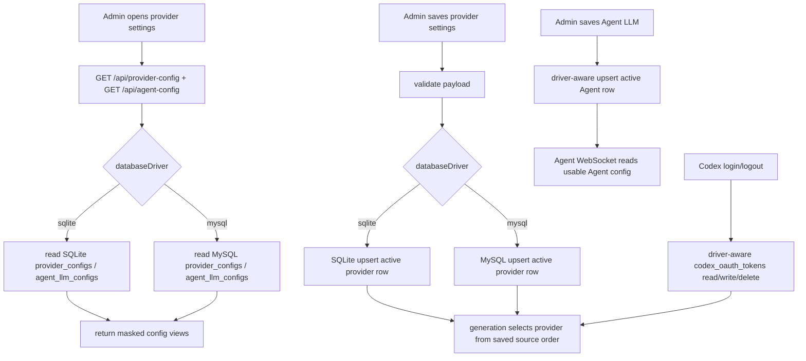

# MySQL Provider And Agent Config Design

## 0. 术语约定

- provider source order：图片生成 provider 的选择顺序，当前共享契约是 `env-openai` → `local-openai` → `codex` 三个 source id。防冲突结论：不是 generation provider scheduler 的并发/重试策略；只决定生成前选择哪个 provider。
- Environment OpenAI-compatible config：来自 `.env` / runtime env 的 `OPENAI_*` 图片 provider 配置。防冲突结论：本 feature 不把 env 配置写入数据库，也不允许 UI 修改 env 值。
- Local OpenAI-compatible config：系统页面保存的图片 provider API key、Base URL、model、timeout。防冲突结论：当前 SQLite 用 `provider_configs` 保存；本 feature 让 MySQL 模式也使用同一语义。
- Agent LLM config：Agent 规划模型的独立 OpenAI-compatible chat 配置，包含 API key、Base URL、model、timeout、supportsVision。防冲突结论：不等于图片 provider；配置了图片 provider 不代表 Agent 已配置。
- Codex fallback：provider source order 的 `codex` 分支，依赖本地 Codex OAuth token。防冲突结论：本 feature 只让已有 Codex fallback 在 MySQL 模式读写可用，不改变 Codex OAuth 协议。
- 配置行：`provider_configs.id = "active"`、`agent_llm_configs.id = "active"`、`codex_oauth_tokens.id = "default"` 这类全局单行。防冲突结论：不是 per-user 配置。

术语 grep 结果：

- `packages/shared/src/provider-config.ts:3` 定义 `PROVIDER_SOURCE_IDS = ["env-openai", "local-openai", "codex"]`。
- `packages/shared/src/provider-config.ts:55` 定义 `ProviderConfigResponse`；`packages/shared/src/provider-config.ts:70` 定义 `SaveProviderConfigRequest`。
- `packages/shared/src/agent.ts:10` 定义 `AgentLlmConfigView`；`packages/shared/src/agent.ts:21` 定义 `SaveAgentLlmConfigRequest`。
- `apps/api/src/domain/providers/provider-config.ts:28` 已固定默认 provider source order；`apps/api/src/domain/agent/config.ts:6` 已固定 active Agent LLM config id。

## 1. 决策与约束

### 需求摘要

面向使用 `USE_MYSQL=true` 的管理员。管理员在后台“生成服务配置”页面保存图片 provider 配置、调整 provider source order、登录/退出 Codex fallback、保存 Agent LLM 配置后，配置应持久化到 MySQL，并被后续图片生成、Codex fallback 选择和 Agent 规划实际读取。

成功标准：

- MySQL 模式下 `GET /api/provider-config` 能返回 MySQL 中保存的 local OpenAI 配置、source order 和 Codex session 状态。
- MySQL 模式下 `PUT /api/provider-config` 能保存 source order 和 local OpenAI 配置，不再返回“只支持环境变量 provider 配置”。
- MySQL 模式下 Codex 登录成功后能保存 token，`codex` source 可显示 available；退出能清掉 token。
- MySQL 模式下 `GET /api/agent-config` / `PUT /api/agent-config` 能读写 Agent LLM 配置，Agent WebSocket 规划能从 MySQL 读到 usable config。
- SQLite 模式行为保持现状。

明确不做：

- 不做 SQLite 配置到 MySQL 的迁移；切换到 MySQL 后需要重新保存系统页面配置。
- 不做 per-user provider / Agent LLM 配置；继续使用全局 active 行，并保持现有 admin-only 路由边界。
- 不做 Agent conversation / Agent skill 的完整 MySQL 持久化；`.codestable/issues/2026-05-28-mysql-agent-sqlite-proxy` 已将它们稳定降级。
- 不合并 `/api/provider-config` 和 `/api/agent-config` 为原子单请求；前端两段保存的半成功问题属于独立 audit finding。
- 不加密或轮换已保存 secret；继续沿用当前本地应用“数据库保存 secret，响应只返回 masked secret”的约束。
- 不把 OSS、MySQL 或 mail gateway 凭据搬进系统页面。

### 复杂度档位

- 健壮性 = L3（偏离内部工具默认 L2 的原因：该路径保存 API key、Base URL、OAuth token，错误路径必须稳定且不能泄漏 secret）。
- 结构 = modules（偏离 functions 的原因：同一领域服务要同时支持 SQLite/MySQL，不应继续用“非 SQLite 直接抛错”的临时分支）。
- 可测试性 = tested（偏离 testable 的原因：MySQL 模式是当前用户实际运行路径，需要 smoke 或等价集成验证）。
- 安全性 = validated（偏离 trusted 的原因：Base URL、source order、timeout 都来自 admin 请求，必须继续走现有 payload 校验和 masked secret 语义）。
- Compatibility = backward-compatible（特殊维度：SQLite 响应契约、UI payload、已有 env provider 优先级不变）。

### 关键决策

1. MySQL 使用与 SQLite 同名同语义的 `provider_configs` 和 `agent_llm_configs` 表。
   - 原因：共享契约已经围绕这两张表的字段设计，MySQL 模式缺的是持久化分支，不是新概念。
   - 另一种做法：把配置塞进 `app_settings` JSON。会把 secret 和注册/积分设置混在一起，名词层变差，不采用。

2. 配置仍是全局单行，不引入 user_id。
   - 原因：当前 provider/Agent 配置接口已改为 admin-only，产品语义是本地工作站的全局生成服务配置。per-user 会要求 generation/Agent 执行按当前用户路由 provider，超出本次目标。

3. MySQL 读写分支放在现有 provider / Agent / Codex domain service 内，返回同一共享契约。
   - 原因：现有 admin/auth/storage store 已采用 `databaseDriver === "sqlite" ? drizzle : mysql2` 的模式；保持调用方不变，能让 UI 和 generation/Agent runtime 直接受益。
   - 约束：MySQL SQL 参数化执行；row packet 手动映射为现有 camelCase row model；响应仍经 `maskedSecret`。

4. Codex fallback 纳入本 feature。
   - 原因：系统页面 provider source order 包含 `codex`，UI 也提供 Codex login/logout。MySQL schema 已有 `codex_oauth_tokens`，但 domain service 当前非 SQLite 返回空或抛错；若不补齐，provider 页面“生效”仍缺一条 source。

5. 保留 env provider 的只读优先级。
   - 原因：`env-openai` 仍由 `OPENAI_*` 决定；source order 可把 `local-openai` 放到 env 前，但 UI 不写 env。

## 2. 名词与编排

### 2.1 名词层

#### 现状

- `ProviderConfigResponse` / `SaveProviderConfigRequest` 在 `packages/shared/src/provider-config.ts:55` 和 `packages/shared/src/provider-config.ts:70` 定义，前后端已经共享 source order、localOpenAI、activeSource 契约。
- SQLite schema 在 `apps/api/src/infrastructure/schema.ts:128` 和 `apps/api/src/infrastructure/sqlite-database.ts:87` 定义 `provider_configs`；`apps/api/src/infrastructure/sqlite-database.ts:486` 初始化 `active` 行。
- `saveProviderConfig()` 在 `apps/api/src/domain/providers/provider-config.ts:55` 遇到 MySQL 直接抛错；`getProviderConfigRow()` 在 `apps/api/src/domain/providers/provider-config.ts:138` 非 SQLite 返回空。
- `AgentLlmConfigView` / `SaveAgentLlmConfigRequest` 在 `packages/shared/src/agent.ts:10` 和 `packages/shared/src/agent.ts:21` 定义。
- SQLite schema 在 `apps/api/src/infrastructure/schema.ts:139` 和 `apps/api/src/infrastructure/sqlite-database.ts:187` 定义 `agent_llm_configs`；`apps/api/src/infrastructure/sqlite-database.ts:496` 初始化 `active` 行。
- `saveAgentLlmConfig()` 在 `apps/api/src/domain/agent/config.ts:42` 遇到 MySQL 直接抛错；`getAgentLlmConfigRow()` 在 `apps/api/src/domain/agent/config.ts:87` 非 SQLite 返回空。
- `codex_oauth_tokens` 已在 MySQL schema 中定义（`apps/api/src/infrastructure/mysql-database.ts:295`），但 `codex-auth.ts:175` 的读取和 `codex-auth.ts:183` 的保存仍只支持 SQLite。
- `docs/generated/db-schema.md:180` / `docs/generated/db-schema.md:195` 仍声明 provider/Agent config 是 SQLite-only。

#### 变化

- MySQL schema 新增 `provider_configs`，字段与 SQLite 语义对齐：

```sql
id VARCHAR(191) PRIMARY KEY NOT NULL
source_order_json TEXT NOT NULL
local_api_key TEXT
local_base_url TEXT
local_model TEXT
local_timeout_ms INT
created_at VARCHAR(32) NOT NULL
updated_at VARCHAR(32) NOT NULL
```

- MySQL schema 新增 `agent_llm_configs`，字段与 SQLite 语义对齐：

```sql
id VARCHAR(191) PRIMARY KEY NOT NULL
api_key TEXT
base_url TEXT NOT NULL
model TEXT NOT NULL
timeout_ms INT NOT NULL
supports_vision TINYINT NOT NULL DEFAULT 0
created_at VARCHAR(32) NOT NULL
updated_at VARCHAR(32) NOT NULL
```

- MySQL 启动迁移确保默认行：
  - `provider_configs.active` 默认 `source_order_json = ["env-openai","local-openai","codex"]`。
  - `agent_llm_configs.active` 默认空 key / 空 baseUrl / 空 model / `timeout_ms = 60000` / `supports_vision = 0`。

- provider config domain 增加 MySQL row read/upsert 分支：
  - 读不到行时仍返回默认 source order 和空 local config。
  - 保存时沿用 `resolveLocalApiKey()` 的 preserve/masked-value 语义。
  - `getProviderSourceOrder()`、`getLocalOpenAIImageProviderConfig()`、`getProviderConfig()` 都可从 MySQL 行读取。

- Agent LLM config domain 增加 MySQL row read/upsert 分支：
  - `getAgentLlmConfig()` 返回 masked view。
  - `getUsableAgentLlmConfig()` 从 MySQL row 判断 `apiKey + model + timeout`。
  - 保存时沿用 `resolveApiKeyForSave()` 的 preserve/masked-value 语义。

- Codex auth domain 增加 MySQL row read/write/delete/update 分支，复用现有 `codex_oauth_tokens` 表，让 `getAuthStatus()`、Codex login/logout、token refresh 在 MySQL 模式下可用。

#### 接口示例

图片 provider 保存：

```http
PUT /api/provider-config
Content-Type: application/json

{
  "sourceOrder": ["local-openai", "env-openai", "codex"],
  "localOpenAI": {
    "apiKey": "sk-local",
    "baseUrl": "https://example.com/v1",
    "model": "gpt-image-2",
    "timeoutMs": 1200000
  }
}
```

期望输出：`200 ProviderConfigResponse`，`localOpenAI.apiKey.hasSecret=true`，`localOpenAI.apiKey.value` 为 masked value，`activeSource.id` 在可用 source 中按 source order 选择。

Agent LLM 保存：

```http
PUT /api/agent-config
Content-Type: application/json

{
  "apiKey": "sk-agent",
  "baseUrl": "https://example.com/v1",
  "model": "gpt-5.5",
  "timeoutMs": 60000,
  "supportsVision": true
}
```

期望输出：`200 AgentLlmConfigView`，`configured=true`，`apiKey.value` 为 masked value；之后 Agent WebSocket 规划不再返回 `missing_agent_config`。

### 2.2 编排层



#### 现状

- Provider config routes 已是 admin-only，`GET /api/provider-config` 调用 `getProviderConfig()`，`PUT /api/provider-config` 调用 `saveProviderConfig()`（`apps/api/src/server/routes/provider-config.ts:8`）。
- Agent config routes 已是 admin-only，`GET /api/agent-config` 调用 `getAgentLlmConfig()`，`PUT /api/agent-config` 调用 `saveAgentLlmConfig()`（`apps/api/src/server/routes/agent-config.ts:8`）。
- 生成执行通过 `createConfiguredImageProvider()` 读取 `getProviderSourceOrder()`，再依次尝试 env、local、codex（`apps/api/src/domain/providers/image-provider-selection.ts:53`）。
- Agent WebSocket 在执行规划前调用 `getUsableAgentLlmConfig()`，缺失时返回 `missing_agent_config`（`apps/api/src/domain/agent/websocket-session.ts:364`）。
- Web provider 页面保存时先 PUT provider，再按需 PUT Agent config（`apps/web/src/features/provider-config/ProviderConfigDialog.tsx:421` 和 `:441`）。

#### 变化

- Provider config route 不变；domain service 根据 driver 读写 SQLite 或 MySQL。MySQL 保存失败仍返回现有 `provider_config_error` 包装，但不再因为 driver 是 MySQL 而拒绝。
- Agent config route 不变；domain service 根据 driver 读写 SQLite 或 MySQL。MySQL 保存失败仍返回现有 `agent_config_error` 包装，但不再因为 driver 是 MySQL 而拒绝。
- Codex auth route 不变；`getCodexTokenRow()` / `storeCodexTokens()` / logout / refresh invalidation 根据 driver 读写对应数据库。
- UI 主流程可保持不变；如后端返回 MySQL 配置，现有 `applyProviderConfig()` / `applyAgentConfig()` 能直接填充表单。

#### 流程级约束

- 错误语义：payload 校验错误继续使用 `invalid_provider_config` / `invalid_agent_config`；数据库写失败折叠为 route 当前稳定错误，不返回 SQL、连接串或 secret。
- 幂等性：启动时默认行用 `INSERT IGNORE` / 等价 upsert；保存 active 行可重复执行，`created_at` 保持原值，`updated_at` 更新。
- Secret 边界：API response 永远只返回 `MaskedSecret`；日志、错误、docs 不输出 raw API key、OAuth token、MySQL password 或 OSS AK/SK。
- Source order：非法或坏 JSON 继续回退 `DEFAULT_PROVIDER_SOURCE_ORDER`，不让坏数据阻断页面读取。
- 并发：本 feature 不引入跨请求锁；最后一次 admin 保存覆盖全局 active 行，与当前 SQLite 语义一致。
- 扩展点：若后续要 per-user provider config，应新开 feature，不在当前全局行上追加 user_id 兼容分支。

### 2.3 挂载点清单

- MySQL schema：`apps/api/src/infrastructure/mysql-database.ts` 的 `mySqlSchema` — 新增 `provider_configs` / `agent_llm_configs` 表定义和默认行初始化。
- Provider config domain：`apps/api/src/domain/providers/provider-config.ts` — 修改为 driver-aware 读写，并让 runtime provider selection 读取 MySQL row。
- Agent LLM config domain：`apps/api/src/domain/agent/config.ts` — 修改为 driver-aware 读写，并让 Agent WebSocket 读取 MySQL row。
- Codex fallback token store：`apps/api/src/domain/providers/codex-auth.ts` — 修改 `codex_oauth_tokens` 读写/删除/刷新为 driver-aware。
- 配置文档：`docs/generated/db-schema.md`、`docs/RELIABILITY.md`、`docs/product-specs/provider-configuration.md` — 修改 SQLite-only 口径，说明 MySQL 模式也支持系统页面配置。

### 2.4 推进策略

1. 持久化骨架：补齐 MySQL `provider_configs` / `agent_llm_configs` schema 和默认 active 行。
   - 退出信号：MySQL 新库启动后两张表和 active 行存在；SQLite 初始化不变。
2. Provider config 分支：让 provider config domain 可在 MySQL 中读写 active row。
   - 退出信号：MySQL 模式下 provider config GET/PUT 能保存 source order/local key，并被 provider selection 读取。
3. Agent LLM 分支：让 Agent config domain 可在 MySQL 中读写 active row。
   - 退出信号：MySQL 模式下 Agent config GET/PUT 能保存配置，`getUsableAgentLlmConfig()` 返回 usable config。
4. Codex fallback 分支：让 Codex token store 在 MySQL 模式读写已有 `codex_oauth_tokens`。
   - 退出信号：MySQL 模式下 Codex login/logout/status 可持久化，source order 中 `codex` 可变为 available。
5. UI 联调与文档：保持系统页面契约不变，更新文档和必要提示。
   - 退出信号：后台 provider 页面在 MySQL 模式保存后刷新仍显示 saved/masked 状态；文档不再声明 provider/Agent config SQLite-only。
6. 验证：补 MySQL/SQLite 关键 smoke 或集成验证，运行 typecheck/build。
   - 退出信号：SQLite provider/Agent 行为不退化，MySQL provider/Agent/Codex 配置路径通过；`pnpm typecheck` 和 `pnpm build` 通过。

### 2.5 结构健康度与微重构

##### 评估

- compound convention：未命中目录组织 / 命名 / 归属类 decision。
- 文件级 — `apps/api/src/domain/providers/provider-config.ts`：361 行，职责集中在 provider source order、local OpenAI config、masked secret；本次会增加 MySQL row read/upsert 分支，属于现有职责延伸。
- 文件级 — `apps/api/src/domain/agent/config.ts`：175 行，职责集中在 Agent LLM config；本次会增加 MySQL row read/upsert 分支，改动密度低。
- 文件级 — `apps/api/src/domain/providers/codex-auth.ts`：481 行，接近偏胖，职责包含 device login、token refresh、token store；本次只补 token store 的 driver 分支，不改变 OAuth 编排。
- 文件级 — `apps/api/src/infrastructure/mysql-database.ts`：753 行，已是集中式 MySQL schema/migration 文件；本次新增两张小表和默认行，沿用现有 schema registry 模式。
- 文件级 — `apps/web/src/features/provider-config/ProviderConfigDialog.tsx`：1204 行，明显偏胖；本次原则上不改变 UI 结构，只用现有 GET/PUT 契约联调。
- 目录级 — `apps/api/src/domain/providers`：4 个同层文件，本次不新增文件或只在同域补小 helper，未达到目录重组信号。
- 目录级 — `apps/api/src/domain/agent`：8 个同层文件，已到注意线；本次不新增 Agent 子模块文件，避免继续摊平。
- 目录级 — `apps/api/src/infrastructure`：8 个同层文件且已有 `providers/`、`storage/` 子目录；本次不新增基础设施文件，只扩展现有 MySQL schema。
- 目录级 — `apps/web/src/features/provider-config`：1 个文件但文件过大；目录不摊平，问题是组件文件职责过重。

##### 结论：不做微重构

原因：本 feature 的核心是补齐 MySQL 持久化分支和配置读取链路。拆 `ProviderConfigDialog.tsx` 或 `codex-auth.ts` 会涉及较多搬移和 import 调整，收益主要是可维护性，不是本功能的必要前置。实现阶段应尽量不改 UI 结构；若必须调整 UI，只做小范围文案/状态处理。

##### 超出范围的观察

- `apps/web/src/features/provider-config/ProviderConfigDialog.tsx`：provider 与 Agent 表单、保存编排、Codex 登录 UI 全在一个 1200 行组件内，后续建议走 `cs-refactor` 拆成 ImageProviderPanel / AgentConfigPanel / CodexSourceCard 或类似结构。
- `apps/api/src/domain/providers/codex-auth.ts`：OAuth 编排和 token persistence 混在一个文件，后续若继续扩展多存储或 token 安全策略，建议走 `cs-refactor` 拆出 token store。

## 3. 验收契约

### 关键场景清单

1. `USE_MYSQL=true` 且 MySQL 新库启动 → 创建 `provider_configs` / `agent_llm_configs` 表，并插入默认 active 行。
2. MySQL 模式 admin 调用 `GET /api/provider-config` → 返回默认 source order、env source 状态、空 localOpenAI、Codex session view，不返回 raw secret。
3. MySQL 模式 admin 调用 `PUT /api/provider-config` 保存 local OpenAI key/baseUrl/model/timeout/sourceOrder → 返回 masked key；随后再次 GET 能读到同一配置。
4. MySQL 模式保存 local OpenAI 后触发图片生成 → provider selection 可以选中 `local-openai`；缺 key 时仍按 source order 尝试其他可用 source。
5. MySQL 模式 provider GET 读到坏 `source_order_json` → 返回默认 source order，不 500。
6. MySQL 模式 admin 调用 `PUT /api/agent-config` 保存 Agent LLM 配置 → 返回 `configured=true` 和 masked key；随后 Agent WebSocket 不再因为缺配置返回 `missing_agent_config`。
7. MySQL 模式 Agent config 保存时只传 masked key 或 `preserveApiKey=true` → 已保存 raw key 不被 masked string 覆盖。
8. MySQL 模式 Codex device login 成功 → token 写入 MySQL `codex_oauth_tokens`；`GET /api/provider-config` 中 `codex.available=true`。
9. MySQL 模式 Codex logout → token 删除；`codex.available=false`，source order 继续保留。
10. SQLite 模式 provider config、Agent config、Codex login/logout 仍按现有 SQLite 行为通过。
11. 非 admin 用户访问 provider/Agent config PUT → 仍被 auth 层拒绝。
12. 数据库或配置错误响应不包含 API key、OAuth token、MySQL password、OSS AK/SK、SQL 连接串或 raw SQL error 细节。

### 明确不做的反向核对项

- 代码中不应出现从 SQLite 自动复制 provider/Agent/Codex 配置到 MySQL 的迁移逻辑。
- `provider_configs` / `agent_llm_configs` 不应新增 `user_id` 或 per-user 路由。
- 本 feature 不应移除 `.codestable/issues/2026-05-28-mysql-agent-sqlite-proxy` 中的 Agent conversation/skill MySQL 降级语义。
- 不应新增把 OSS、MySQL、MAIL_GATEWAY 或 Redis 凭据写入系统页面的字段。
- 不应新增合并 provider+Agent 的新保存 endpoint；若要原子保存，另开 audit remediation。

## 4. 与项目级架构文档的关系

acceptance 阶段需要同步更新：

- `.codestable/architecture/ARCHITECTURE.md` 的术语/模块索引：补充 provider config、Agent LLM config、Codex token 在 SQLite/MySQL 中的持久化边界。
- `.codestable/architecture/ARCHITECTURE.md` 的关键架构决定：记录 provider/Agent 配置是 admin-only 全局配置，MySQL 模式与 SQLite 模式共享同一配置契约；env provider 仍为只读 source。
- `docs/generated/db-schema.md`：移除 provider_configs / agent_llm_configs “SQLite-only” 口径，加入 MySQL 类型差异。
- `docs/RELIABILITY.md` 和 `docs/product-specs/provider-configuration.md`：说明 MySQL + OSS 模式下系统页面 provider/Agent 配置可用，但不迁移 SQLite 旧配置。
