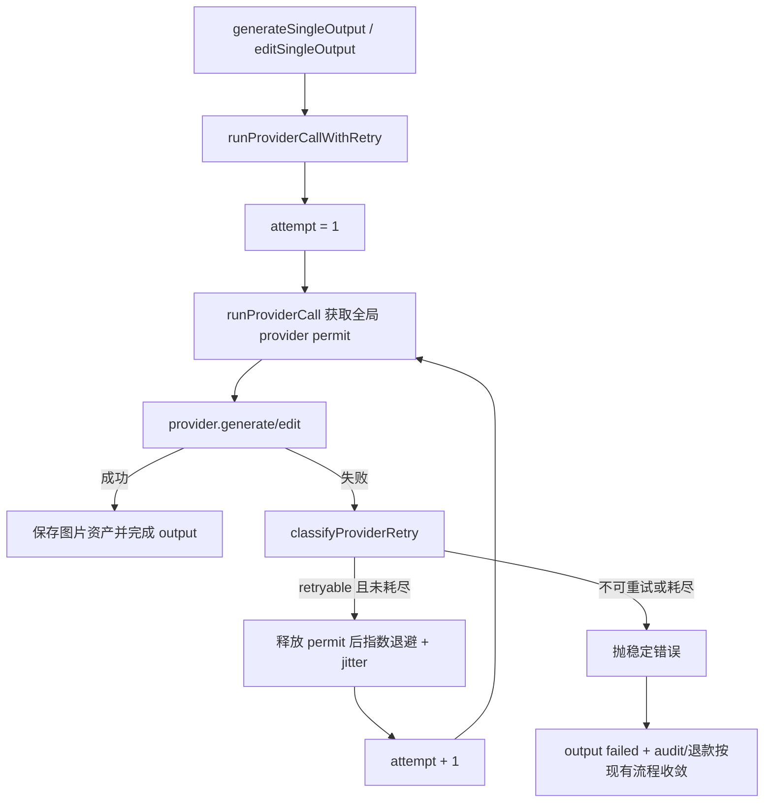

## 0. 术语约定

- provider retry policy：provider call 失败后的错误分类和退避策略。防冲突结论：它不是 Agent 的 `retry_failed` 计划重跑能力。
- provider attempt：一次进入 `runProviderCall` 并实际尝试 provider.generate/edit 的调用。每次重试都重新申请全局 provider permit。
- max retries：首轮失败后的额外重试次数。`GENERATION_PROVIDER_MAX_RETRIES=2` 表示最多 3 次 provider attempt。
- retryable provider error：429、408、5xx、连接超时和临时网络中断。
- stable failure summary：最终写入 output / generation / audit 的稳定错误摘要，不保存上游原始敏感错误。

## 1. 决策与约束

### 需求摘要

`generation-queue-worker` 已让手动生成进入 Redis 队列，`provider-global-semaphore` 已限制整个应用打到唯一 provider 的总并发。当前 provider call 一旦遇到 429、超时或 5xx 会直接变成失败 output；高并发队列下这些可恢复错误会被快速放大。本 feature 增加 provider call 级重试：每个单图 output 调用 provider 前后套统一 retry policy，可重试错误按指数退避 + jitter 等待，最终失败写稳定摘要。

成功标准：

- 新增 `classifyProviderRetry(error, attempt, maxAttempts)`，能区分 retryable 和 non-retryable provider 错误。
- 默认配置为 `GENERATION_PROVIDER_MAX_RETRIES=2`、`GENERATION_PROVIDER_RETRY_BASE_MS=1000`、`GENERATION_PROVIDER_RETRY_MAX_MS=30000`，非法值回退默认。
- 每次 retry attempt 都重新通过 `runProviderCall`，不得绕过全局 provider 并发闸门。
- retry sleep 期间不占 provider permit；AbortSignal 取消时立即停止重试并保持取消语义。
- retryable 错误耗尽后，output 标记 failed，错误摘要稳定化，不把 API key、Bearer token 或上游原始详情透出。

明确不做：

- 不做多 provider failover、权重路由或 provider 级独立限额。
- 不做 per-output Redis job、delayed queue、重启后继续剩余退避或失败 output 后续补偿重跑。
- 不改 Agent 的 `retry_failed` 用户操作语义，也不把 Agent generation job 接入 Redis queue。
- 不新增前端 retrying 状态、admin retry 监控或队列可观测性面板。
- 不改变积分价格、最大图片数、退款规则或生成记录表结构。

### 复杂度档位

- 健壮性 = L3：可恢复 provider 错误自动退避重试；不可恢复错误不得空转。
- 结构 = modules：新增独立 retry policy 模块，避免把错误分类塞进 `image-generation.ts`。
- 安全性 = validated：最终失败摘要必须稳定并经过敏感信息收敛。
- 可测试性 = tested：新增 smoke 覆盖分类、配置、成功重试、非重试错误和最终失败摘要。
- Concurrency = distributed-aware：retry attempt 继续复用 provider scheduler；sleep 不占 Redis permit。

### 关键决策

1. 重试放在 provider call 级，而不是 generation job 级。
   - 原因：当前 queue 是 generation 级 job，`finish*Generation` 内部已经按单 output 收敛成功/失败。provider call 级重试能在 output 失败落库前完成补救，避免重复生成已成功 output。
   - 另一种做法：失败后重新入队整个 generation job。会重复已成功输出，牵涉幂等 output 写入和退款冲突，属于后续 per-output state bridge 范围。

2. 每次 retry 都调用 `runProviderCall`。
   - 原因：`GENERATION_PROVIDER_GLOBAL_CONCURRENCY` 限制的是整个应用同一时刻打到 provider 的总请求数，retry attempt 也必须占同一组 permit。
   - 另一种做法：在已经拿到 permit 后循环重试。会让退避 sleep 占住 permit，降低队列吞吐并制造假并发占用。

3. retryable 最终失败统一抛稳定 `ProviderError`。
   - 原因：不同 provider 的 5xx/网络错误详情可能包含 token、请求内部信息或噪声，最终写 output/audit 时不应透出。
   - 另一种做法：直接保存最后一次 provider error message。OpenAI 兼容 provider 当前较稳定，但 Codex fallback 的上游 detail 更不可控，不采用。

## 2. 名词与编排

### 2.1 名词层

#### 现状

- `apps/api/src/domain/generation/image-generation.ts` 的 `generateSingleOutput` / `editSingleOutput` 调用 `runProviderCall` 后，任何非 abort 错误都会立即返回 failed output。
- `apps/api/src/infrastructure/providers/image-provider.ts` 把 OpenAI SDK 错误转换成 `ProviderError`，保留稳定 code 和 HTTP status。
- `apps/api/src/infrastructure/providers/codex-image-provider.ts` 把 Codex HTTP/fetch 错误转换成 `ProviderError`，部分 detail 已做 secret redaction。
- `failGenerationRecord` 和 output completion 已通过 `sanitizeGenerationErrorMessage` 做二次敏感信息收敛。

#### 变化

新增 retry policy 配置：

```ts
interface ProviderRetryConfig {
  maxRetries: number;
  baseDelayMs: number;
  maxDelayMs: number;
}
```

新增 retry decision：

```ts
type ProviderRetryDecision =
  | { retry: true; delayMs: number; reason: string }
  | { retry: false; reason: string };

function classifyProviderRetry(error: unknown, attempt: number, maxAttempts: number): ProviderRetryDecision;
```

新增 provider retry 执行入口：

```ts
async function runProviderCallWithRetry<T>(input: ProviderCallInput<T>): Promise<T>;
```

新增环境变量：

```text
GENERATION_PROVIDER_MAX_RETRIES=2
GENERATION_PROVIDER_RETRY_BASE_MS=1000
GENERATION_PROVIDER_RETRY_MAX_MS=30000
```

### 2.2 编排层



#### 现状

provider scheduler 已是所有 `provider.generate` / `provider.edit` 的唯一闸门。队列 worker 会重建 DB generation record 并调用 `finishTextToImageGeneration` / `finishReferenceImageGeneration`；Agent 现有路径也回到同一 finish 流程。

#### 变化

- `generateSingleOutput` 和 `editSingleOutput` 改为调用 `runProviderCallWithRetry`。
- `runProviderCallWithRetry` 内部循环执行 `runProviderCall`；失败后调用 `classifyProviderRetry`。
- 可重试错误按 `baseDelayMs * 2^(attempt - 1)` 计算退避，再加 jitter，并受 `maxDelayMs` 限制。
- 不可重试错误直接抛出原稳定错误；retryable 错误耗尽后抛稳定 ProviderError。
- AbortSignal 在进入 attempt 前、provider call 内、retry delay 期间都生效。

#### 流程级约束

- 并发语义：retry attempt 也是 provider call，必须受 `GENERATION_PROVIDER_GLOBAL_CONCURRENCY` 限制。
- 错误语义：429、408、5xx、连接超时和临时网络中断可重试；缺少 provider、缺少 API key、400 参数错误、参考图非法和用户取消不可重试。
- 安全边界：retry 日志和最终错误摘要不得包含 prompt、API key、Bearer token、reference bytes 或上游原始详情。
- DB 边界：retry attempt 不单独写 generation output；只有最终成功或最终失败走现有 output completion。
- 扩展点：后续 per-output Redis job 可以复用 `classifyProviderRetry` 和配置，不另写一套错误分类。

### 2.3 挂载点清单

- Retry policy 模块：新增 `apps/api/src/domain/generation/provider-retry-policy.ts`。
- Provider call 接入：`apps/api/src/domain/generation/image-generation.ts` 的单图 provider call 改为通过 retry wrapper。
- 配置与部署：`.env.example`、`docker-compose.yml` 增加 provider retry 环境变量。
- 文档：`docs/RELIABILITY.md`、`docs/SECURITY.md` 记录 retry 行为和稳定错误摘要边界。
- 测试入口：新增 provider retry smoke，覆盖配置、分类和执行行为。
- Roadmap 状态：`provider-retry-policy` 从 `planned` 改为 `in-progress`。

### 2.4 推进策略

1. 名词契约：新增 retry config、decision 类型、分类函数和 retry wrapper。
   - 退出信号：配置默认值/非法值解析稳定，分类函数覆盖 retryable / non-retryable。
2. Provider call 接入：单图 generate/edit 改为 retry wrapper，保持每次 attempt 进入 `runProviderCall`。
   - 退出信号：grep 显示单图 provider call 不再直接调用 `runProviderCall`。
3. 稳定失败摘要：retryable 耗尽后写稳定 ProviderError，非重试错误保持现有稳定业务语义。
   - 退出信号：smoke 证明最终失败不包含 secret-like 文本。
4. 配置与文档：更新 env、Docker、可靠性和安全文档。
   - 退出信号：默认 retry 次数、退避、不可重试类型和错误摘要边界被记录。
5. 验证：运行 typecheck/build、provider retry smoke、queue smoke、provider scheduler smoke、executor/planner smoke。
   - 退出信号：关键 smoke 通过，未引入 Redis 队列残留。

### 2.5 结构健康度与微重构

##### 评估

- compound convention：未命中目录组织 / 命名 / 错误分类类 decision；已有 concurrency 探索只约束 provider 并发问题背景。
- 文件级 — `apps/api/src/domain/generation/image-generation.ts`：约千行，职责偏大；本次只替换两个 provider call wrapper，不继续塞入重试分类。
- 文件级 — `apps/api/src/domain/generation/provider-scheduler.ts`：职责是 permit acquire/release，不承担错误分类和 retry sleep。
- 文件级 — provider 实现：已负责把 SDK/fetch 错误转换为 `ProviderError`，本次不改变 provider 请求体和响应解析。
- 目录级 — `apps/api/src/domain/generation`：新增 `provider-retry-policy.ts` 与 scheduler/queue 同属 generation 调度能力，暂不需要重组目录。

##### 结论：不做微重构

原因：新增独立 retry policy 文件能避免 `image-generation.ts` 和 `provider-scheduler.ts` 职责继续混杂。拆分 `image-generation.ts` 是更大的行为不变重构，不作为本 feature 前置；后续 per-output state bridge 落地时再评估是否拆出 output runner。

## 3. 验收契约

### 关键场景清单

1. 未设置 retry env -> 默认 max retries 为 2、base delay 为 1000ms、max delay 为 30000ms。
2. 设置非法 retry env -> 回退默认值，不抛启动错误。
3. provider 先返回 429/5xx，随后成功 -> 同一个 output 最终 succeeded，attempt 数符合配置。
4. provider 返回 400 或 `missing_provider` / `missing_api_key` -> 不重试，直接失败收敛。
5. retryable 错误重试耗尽 -> output failed，错误摘要稳定，不包含 API key、Bearer token 或原始上游 detail。
6. retry delay 期间取消 -> 立刻抛 AbortError，不继续新 attempt。
7. `GENERATION_PROVIDER_GLOBAL_CONCURRENCY=1` 且多个 retry attempt 并发 -> 同一时刻进入 provider 的 call 仍不超过 1。
8. 手动生成 Redis queue worker 和 Agent 现有 finish 路径都通过同一 retry wrapper。

### 明确不做的反向核对项

- 不新增 `generation:queue:delayed`、`generation:attempt:*` 或 per-output Redis job。
- 不改 Agent executor 的 `retry_failed` 计划重跑语义。
- 不新增前端 retrying UI、admin retry monitor 或队列可观测性。
- 不改积分价格、最大图片数、退款规则或生成记录表结构。

## 4. 与项目级架构文档的关系

acceptance 阶段应把以下内容提炼回 architecture：

- provider retry policy 已成为单图 provider call 的统一包装层。
- retry attempt 重新进入 provider scheduler，不占用 sleep 期间的 provider permit。
- 默认 `GENERATION_PROVIDER_MAX_RETRIES=2`，退避由 `GENERATION_PROVIDER_RETRY_BASE_MS` / `GENERATION_PROVIDER_RETRY_MAX_MS` 控制。
- 当前仍未实现 per-output Redis job、delayed retry queue、Agent queue adapter、取消恢复和 retry 可观测性。
