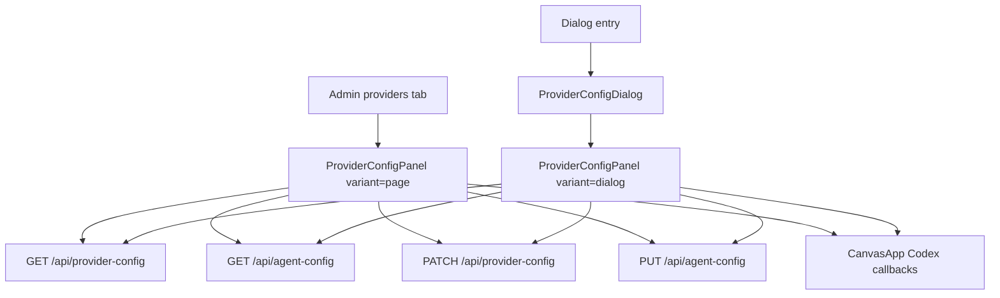

# 管理后台生成服务配置平铺设计

## 现状证据

- `apps/web/src/features/provider-config/ProviderConfigDialog.tsx` 已把配置主体抽成 `ProviderConfigPanel`，支持 `variant: "dialog" | "page"`。
- `ProviderConfigPanel` 内部统一负责：
  - 读取 `/api/provider-config`
  - 读取 `/api/agent-config`
  - 保存图像服务配置和 Agent 大模型配置
  - 刷新 Provider / Agent 状态
  - 密钥掩码展示
  - Codex 登录 / 退出入口
  - 成功 / 错误反馈
- `ProviderConfigDialog` 仍只作为弹窗外壳，复用同一个 `ProviderConfigPanel variant="dialog"`。
- `apps/web/src/features/admin/AdminPage.tsx` 的 `providers` 标签已直接渲染：
  - `ProviderConfigPanel {...providerConfig} variant="page"`.
- `apps/web/src/features/canvas/CanvasApp.tsx` 已把 Codex 登录、Codex 退出、Provider 刷新、Agent 刷新等回调透传给后台页。
- `apps/web/src/styles/provider-config.css` 已存在 `.provider-config-panel--page`、page footer、page body 的样式分支。

## 设计目标

本任务不重写 Provider 配置业务逻辑。实现目标是让后台“生成服务”标签页成为主配置面，同时保持原弹窗入口可用。

核心原则：

- 同一份配置组件承载弹窗和后台页，避免两套加载 / 保存 / 刷新 / 掩码逻辑。
- 后台页不再出现“打开生成服务配置”作为主路径。
- 后台页直接展示图像模型、Agent 大模型、路由优先级、来源详情、Codex fallback。
- 若当前代码已满足需求，实现阶段以验证为主，只修补发现的 UI、文案或响应式缺口。

## 组件边界

### `ProviderConfigPanel`

保留为配置主体组件。

职责：

- 发起 Provider / Agent 配置请求。
- 管理配置表单本地状态。
- 管理图像服务与 Agent 配置 tab。
- 管理来源顺序拖拽 / 上移 / 下移。
- 管理保存、刷新、消息反馈。
- 通过外部传入的 Codex 回调执行登录 / 退出。

不新增后端接口，不新增 shared 契约字段。

### `ProviderConfigDialog`

保留为弹窗外壳。

职责：

- 渲染 backdrop、dialog role、关闭按钮。
- 调用 `ProviderConfigPanel variant="dialog"`。

### `AdminPage`

`providers` tab 直接渲染 `ProviderConfigPanel variant="page"`。

职责：

- 保留后台 tab 切换和页面标题。
- 不复制 Provider 表单字段。
- 不单独实现配置请求。

### `CanvasApp`

继续作为上层状态和跨入口回调提供者。

职责：

- 给后台页传入 `providerConfig` props。
- 保留原画布侧 Provider 状态弹层 / Codex 登录弹窗。
- `admin/providers` 路由打开时进入后台 providers tab。

## 数据流

## UI 设计

后台页结构：

1. `AdminPage` 标题：生成服务配置。
2. `ProviderConfigPanel variant="page"`：
   - 顶部两个 tab：生图模型 / Agent 大模型。
   - 生图模型 tab：
     - 当前来源概览。
     - 本地 OpenAI-compatible 表单。
     - 路由顺序。
     - 来源详情和 Codex 登录 / 退出。
   - Agent 大模型 tab：
     - API Key、Base URL、模型、超时、视觉能力。
   - 底部刷新 / 保存按钮。

移动端：

- Provider 面板随后台页自然纵向堆叠。
- 弹窗专属 max-height / backdrop 不影响 page variant。
- 按钮和输入框保留 40px 以上点击区域。

## 兼容性

- 原弹窗入口继续使用 `ProviderConfigDialog`，不改变调用签名。
- 后台页只消费既有 `ProviderConfigPanelProps`。
- 不修改 Provider 来源优先级语义。
- 不改变 `/api/provider-config`、`/api/agent-config` 请求 / 响应格式。

## 风险

- 风险 1：page variant 复用 dialog class 名，可能在窄屏继承弹窗样式导致拥挤。
  - 应对：浏览器验证 `/admin/providers` 桌面和移动视口。
- 风险 2：后台刷新按钮和 Provider 面板内部刷新按钮同时存在，用户可能误解。
  - 应对：保持后台刷新用于用户/设置/审计整体数据，Provider 面板刷新用于生成服务配置；若视觉混淆，再调整文案或间距。
- 风险 3：Codex 登录弹窗由 `CanvasApp` 管理，后台页点击登录时仍应打开同一个登录流程。
  - 应对：浏览器验证按钮存在且不报错；不在本任务内模拟真实外部授权完成。

## 回滚

若实现阶段发现当前 page variant 不稳定，回滚路径：

- 后台 providers tab 恢复为按钮入口。
- 保留 `ProviderConfigPanel` 抽象不动。
- Provider 配置弹窗继续作为稳定主路径。
